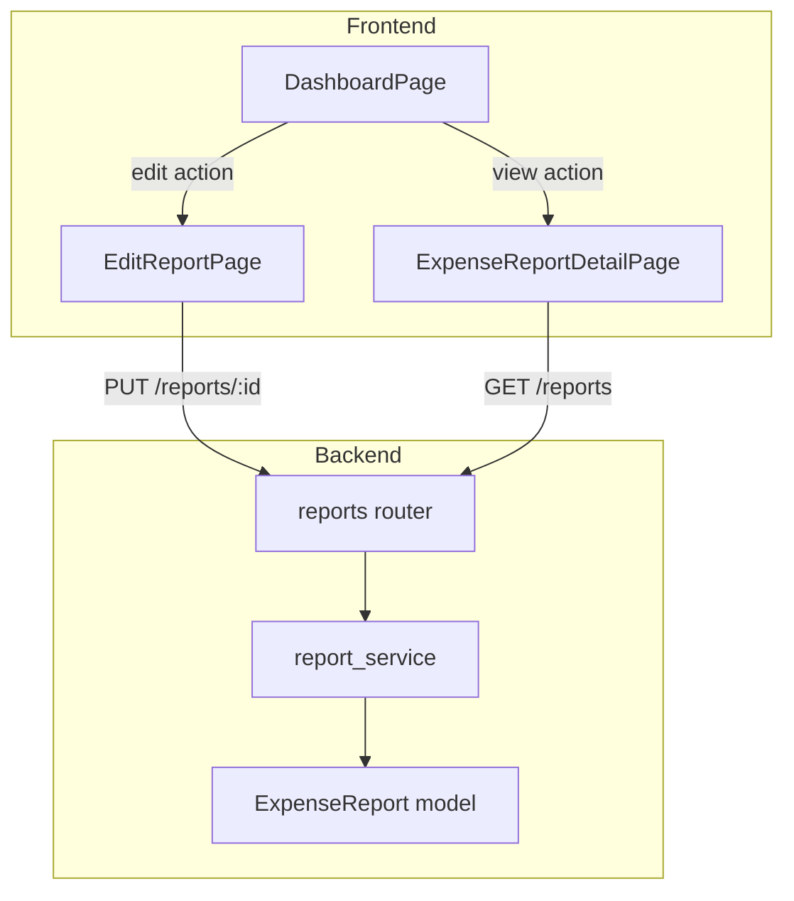

# Design Document: Admin Edit and Notes

## Overview

This feature extends the expense report system with two capabilities:

1. **Admin Edit Access** — Admin users can edit any expense report regardless of its current status (bypassing the existing "In Progress" / "Rejected" restriction that applies to regular users).
2. **Admin Notes Field** — A dedicated `admin_notes` field is visible on both the Edit Screen and View Screen. Admins can edit it; regular users see it read-only.

The existing `update_report` service function enforces ownership and status checks. This design introduces a parallel admin-specific update path that skips status restrictions while preserving the same field validation rules. The frontend conditionally renders edit controls and the admin notes field based on the authenticated user's role.

## Architecture

The feature follows the existing layered architecture:



### Key Architectural Decisions

1. **Single endpoint, role-branching logic**: Rather than creating a separate `/admin/reports/:id` endpoint, the existing `PUT /reports/{id}` endpoint is extended with role-aware logic. The router detects whether the caller is an Admin and delegates to the appropriate service function. This keeps the API surface minimal and avoids duplicating response schemas.

2. **Admin notes stripped from non-admin requests**: The service layer silently discards any `admin_notes` value submitted by a non-admin user, rather than returning an error. This simplifies the frontend (no need to conditionally exclude the field from the payload) and matches the requirements (Req 5.4, 7.5).

3. **Frontend role-based rendering**: The `EditReportPage` and `ExpenseReportDetailPage` components conditionally render the admin notes field based on the user's role. The `getRowActions` utility is updated so admins see an "edit" action on all reports regardless of status.

## Components and Interfaces

### Backend Changes

#### 1. Pydantic Schema: `AdminExpenseReportUpdate`

A new schema extending the update payload to include `admin_notes`:

```python
class AdminExpenseReportUpdate(BaseModel):
    title: Optional[str] = Field(default=None, min_length=1, max_length=255)
    description: Optional[str] = Field(default=None)
    reimbursable_from_client: Optional[bool] = Field(default=None)
    client: Optional[str] = Field(default=None)
    admin_notes: Optional[str] = Field(default=None, max_length=1000)

    @model_validator(mode="after")
    def validate_client(self) -> "AdminExpenseReportUpdate":
        if self.reimbursable_from_client and not self.client:
            raise ValueError("client is required when reimbursable_from_client is true")
        if self.client is not None:
            from app.constants import CLIENTS
            if self.client not in CLIENTS:
                raise ValueError(f"client must be one of: {CLIENTS}")
        return self
```

#### 2. Service Function: `admin_update_report`

New function in `report_service.py`:

```python
def admin_update_report(
    db: Session,
    report_id: int,
    data: AdminExpenseReportUpdate,
) -> ExpenseReport:
    """Update an expense report as an Admin (no status/ownership restrictions).

    - Applies only explicitly provided (non-None) fields.
    - Does NOT change the report's status.
    - Validates field constraints via the Pydantic schema.
    - Returns 404 if report not found.
    """
```

#### 3. Router: Updated `PUT /reports/{report_id}`

The existing endpoint is refactored to branch on role:

```python
@router.put("/{report_id}", response_model=ExpenseReportResponse)
def update_report(
    report_id: int,
    data: AdminExpenseReportUpdate,  # superset schema accepts admin_notes
    current_user: User = Depends(get_current_user),
    db: Session = Depends(get_db),
) -> ExpenseReportResponse:
    # Reload user with role
    user_with_role = db.query(User).options(joinedload(User.role)).filter(User.id == current_user.id).one()

    if user_with_role.role.name == "Admin":
        report = report_service.admin_update_report(db, report_id, data)
    else:
        # Strip admin_notes, delegate to existing update_report
        user_data = ExpenseReportUpdate(
            title=data.title,
            description=data.description,
            reimbursable_from_client=data.reimbursable_from_client,
            client=data.client,
        )
        report = report_service.update_report(db, report_id, user_data, current_user)
    return _to_response(report, db)
```

#### 4. Service Function: `update_report` (existing — unchanged)

The existing function retains its ownership and status checks for non-admin users. No modifications needed.

### Frontend Changes

#### 1. TypeScript Type: `ExpenseReportUpdate`

Add `admin_notes` as an optional field:

```typescript
export interface ExpenseReportUpdate {
  title?: string;
  description?: string;
  reimbursable_from_client?: boolean;
  client?: string;
  admin_notes?: string;
}
```

#### 2. Zod Schema: `expenseReportUpdateSchema`

Add `admin_notes` validation:

```typescript
admin_notes: z.string().max(1000, 'Admin notes must be 1000 characters or less').optional(),
```

#### 3. `EditReportPage` Updates

- Add `adminNotes` state field, pre-populated from `report.admin_notes`.
- If user is Admin: render an editable `<TextField multiline>` for admin notes with 1000 char max.
- If user is regular User: render a read-only `<Typography>` or disabled `<TextField>` showing admin notes (visually distinct, non-interactive).
- Include `admin_notes` in the update payload when user is Admin.

#### 4. `ExpenseReportDetailPage` (View Screen) Updates

- Display an "Admin Notes" section with a visible label.
- Show the content preserving line breaks (using `whiteSpace: 'pre-wrap'`).
- If empty, show placeholder text: "No admin notes have been added."
- If content exceeds 500 characters, wrap in a scrollable `<Box>` with `maxHeight: 200px`.
- Read-only for all users (both Admin and regular).

#### 5. `getRowActions` Utility Update

Add a new rule for Admin users to see "edit" on all reports:

```typescript
// New Rule: Admin can edit any report regardless of status
if (isAdmin) {
  return ['edit', 'view'];  // edit + view for all statuses
}
```

This rule is inserted before the existing rules so that admins always get edit access. The existing Rule 2 (admin reviewing submitted reports with accept/reject) takes priority for "Submitted" status.

#### 6. `DashboardPage` — No structural changes

The `handleEdit` callback already navigates to `/reports/:id/edit`. The `ExpenseReportsTable` will show the edit action for admins via the updated `getRowActions`.

## Data Models

### Existing Model (no schema migration needed)

The `admin_notes` column already exists on the `expense_reports` table:

```python
class ExpenseReport(Base):
    __tablename__ = "expense_reports"

    id: Mapped[int] = mapped_column(Integer, primary_key=True, autoincrement=True)
    title: Mapped[str] = mapped_column(String(255), nullable=False)
    description: Mapped[str | None] = mapped_column(Text, nullable=True)
    status: Mapped[str] = mapped_column(String(50), nullable=False, default="In Progress")
    owner_id: Mapped[int] = mapped_column(Integer, ForeignKey("users.id"), nullable=False)
    created_at: Mapped[datetime] = mapped_column(DateTime, nullable=False)
    reimbursable_from_client: Mapped[bool] = mapped_column(Boolean, nullable=False, default=False)
    client: Mapped[str | None] = mapped_column(String(255), nullable=True)
    admin_notes: Mapped[str | None] = mapped_column(Text, nullable=True)  # Already exists
```

### Field Constraints

| Field | Type | Constraints |
|-------|------|-------------|
| `admin_notes` | Text (nullable) | Max 1000 characters (enforced at schema level) |
| `title` | String(255) | 1–255 characters, required |
| `client` | String(255) | Must be in CLIENTS list when `reimbursable_from_client` is true |

### Response Schema (existing — no changes needed)

`ExpenseReportResponse` already includes `admin_notes: Optional[str]`, so the API response already exposes this field to all authenticated users.


## Correctness Properties

*A property is a characteristic or behavior that should hold true across all valid executions of a system — essentially, a formal statement about what the system should do. Properties serve as the bridge between human-readable specifications and machine-verifiable correctness guarantees.*

### Property 1: Admin update succeeds for any status without changing status

*For any* expense report in any valid status (In Progress, Submitted, Rejected, Scheduled for Payment), when an Admin submits a valid update, the update SHALL succeed and the report's status SHALL remain unchanged.

**Validates: Requirements 1.1, 1.4**

### Property 2: Admin partial update preserves unprovided fields

*For any* expense report and any admin update payload where some fields are omitted (None), the omitted fields SHALL retain their original values after the update is applied. Only explicitly provided fields SHALL be modified.

**Validates: Requirements 1.3, 6.4**

### Property 3: Admin update rejects invalid input without persisting changes

*For any* admin update payload containing invalid field values (title empty or > 255 characters, client not in CLIENTS list when reimbursable_from_client is true), the service SHALL return a validation error and the report SHALL remain unchanged in the database.

**Validates: Requirements 1.5, 1.6**

### Property 4: Non-admin update discards admin_notes from payload

*For any* update request from a User with User_Role that includes an `admin_notes` value, the service SHALL discard the `admin_notes` value and preserve the existing `admin_notes` on the report. All other valid fields in the payload SHALL be processed normally.

**Validates: Requirements 5.4, 7.5**

### Property 5: Admin dashboard shows edit action for all reports

*For any* expense report with any status and any owner, when `getRowActions` is called with an Admin user, the returned actions SHALL include "edit".

**Validates: Requirements 2.1**

### Property 6: Regular user dashboard shows edit action only for owned editable reports

*For any* expense report, when `getRowActions` is called with a non-Admin user, "edit" SHALL appear in the returned actions if and only if the user owns the report AND the report status is "In Progress" or "Rejected".

**Validates: Requirements 2.3**

### Property 7: Admin notes round-trip persistence

*For any* valid admin_notes string (≤ 1000 characters), when an Admin updates a report's admin_notes field and the report is subsequently retrieved, the returned admin_notes value SHALL equal the value that was submitted.

**Validates: Requirements 6.2**

### Property 8: Non-owner regular user cannot update reports

*For any* expense report not owned by the requesting User_Role user, an update attempt SHALL return a 403 Forbidden response regardless of the report's status (when the report is in an editable status).

**Validates: Requirements 7.3**

## Error Handling

### Backend Error Responses

| Scenario | Status Code | Detail Message |
|----------|-------------|----------------|
| Unauthenticated request | 401 | "Not authenticated" |
| Non-admin updating report they don't own | 403 | "You do not have permission to modify this report" |
| Non-admin updating non-editable status report | 409 | "Cannot perform this action on a report with status '{status}'" |
| Report not found | 404 | "Report not found" |
| Validation failure (Pydantic) | 422 | Standard FastAPI validation error body with field-level details |
| Status + ownership violation (non-admin, non-owner, non-editable status) | 409 | Status restriction evaluated first per Req 7.6 |

### Error Priority (Non-Admin Users)

When multiple violations exist, the service evaluates in this order:
1. **404** — Report does not exist
2. **409** — Report status is not editable (Submitted, Scheduled for Payment)
3. **403** — User is not the report owner

This ordering matches Requirement 7.6: status restriction is evaluated before ownership.

### Frontend Error Handling

- **Client-side validation errors**: Displayed inline adjacent to the relevant field. Form is not submitted.
- **Server-side validation errors (422)**: Parsed from the response body and displayed adjacent to the relevant field. All form values are retained.
- **API errors (403, 404, 409)**: Displayed as an `ErrorAlert` banner above the form.
- **Network errors**: Displayed as a generic error message in the `ErrorAlert` component.
- **Submission state**: All form fields and the submit button are disabled while the request is in flight to prevent duplicate submissions.

## Testing Strategy

### Backend Testing (pytest)

**Unit Tests:**
- `admin_update_report` service function: success cases, partial updates, validation failures
- `update_report` existing function: verify admin_notes is stripped from non-admin payloads
- `AdminExpenseReportUpdate` schema validation: valid/invalid inputs
- Error priority ordering (409 before 403)

**Integration Tests:**
- `PUT /reports/{id}` as Admin: successful update across all statuses
- `PUT /reports/{id}` as Admin: 404 for non-existent report
- `PUT /reports/{id}` as Admin: 422 for invalid fields
- `PUT /reports/{id}` as User: verify admin_notes discarded
- `PUT /reports/{id}` as User: 409 for non-editable status
- `PUT /reports/{id}` as User: 403 for non-owned report

**Property-Based Tests (Hypothesis):**
- Property 1: Admin update succeeds for any status without changing status
- Property 2: Admin partial update preserves unprovided fields
- Property 3: Admin update rejects invalid input without persisting
- Property 4: Non-admin update discards admin_notes
- Property 7: Admin notes round-trip persistence
- Property 8: Non-owner regular user gets 403

Each property test runs a minimum of 100 iterations. Tests are tagged with:
`Feature: admin-edit-and-notes, Property {number}: {property_text}`

**PBT Library:** Hypothesis (already used in the project — see `.hypothesis/` directory)

### Frontend Testing (Vitest)

**Unit Tests:**
- `getRowActions` utility: verify admin always gets "edit", regular user only for owned editable reports (Properties 5, 6)
- `expenseReportUpdateSchema` Zod validation with `admin_notes` field
- Admin notes rendering logic (line break preservation, scrollable container for long content)

**Component Tests:**
- `EditReportPage`: admin sees editable admin_notes field, regular user sees read-only
- `EditReportPage`: form disabled during submission
- `ExpenseReportDetailPage`: admin notes displayed with label, placeholder for empty
- `ActionCell`: admin sees edit action on all reports

**Property-Based Tests (fast-check):**
- Property 5: getRowActions with admin user always includes "edit"
- Property 6: getRowActions with regular user includes "edit" iff owned + editable status

PBT Library: fast-check (compatible with Vitest)
Each property test runs a minimum of 100 iterations.
