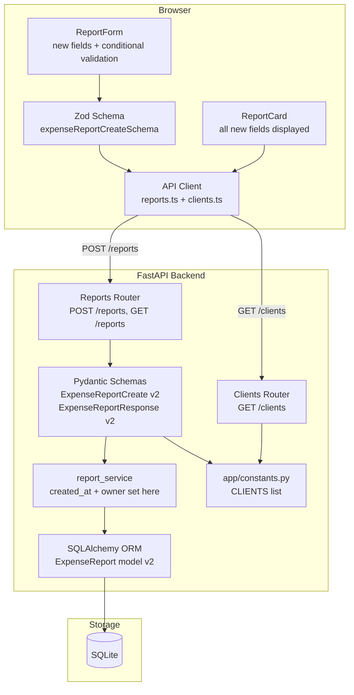

# Design Document: Expense Report Fields Enhancement

## Overview

This feature extends the existing `ExpenseReport` entity with six new fields: `owner` (auto-populated from session), `created_at` (server-side UTC timestamp), `description` (renamed from `purpose`, now optional), `reimbursable_from_client` (boolean, default `false`), `client` (optional string from a seeded list, required when `reimbursable_from_client` is `true`), and `admin_notes` (optional free text).

The change touches every layer of the stack: the SQLAlchemy ORM model, Pydantic schemas, the service layer, the API contract, TypeScript types, Zod validation schemas, and the `ReportCard` / `ReportForm` frontend components. No data migration is required — existing records will be dropped and recreated.

### Key Design Decisions

- **`purpose` → `description` rename is a breaking change.** The column, Pydantic field, TypeScript type, and Zod schema all change from `purpose` to `description`. The field becomes optional (nullable in the DB, `None`/`null` in the API).
- **`owner` is resolved server-side.** The `owner_id` foreign key already exists; the response schema will now also include the owner's `username` by joining through the relationship. The client never sends an owner.
- **`created_at` is set server-side.** `datetime.now(timezone.utc)` is called in the service layer at creation time. The column uses `nullable=False` with no client-supplied default.
- **Client list is a module-level constant.** No separate DB table is needed yet. A `CLIENTS` list in a new `app/constants.py` module is the single source of truth for both Pydantic validation and the `GET /clients` endpoint that feeds the frontend dropdown.
- **Conditional validation is implemented in both Pydantic and Zod.** Pydantic uses a `model_validator` (mode `"after"`) to enforce that `client` is required when `reimbursable_from_client` is `true`. The Zod schema uses `.superRefine()` for the same rule.
- **`admin_notes` is read-only from the form perspective for now.** The field is stored and returned but the `Create_Report_Form` does not expose it for user input — it is reserved for future admin tooling. The `ExpenseReportCreate` schema does not include it; it defaults to `None` on creation.

---

## Architecture

The change is additive within the existing layered architecture. No new services or routers are introduced. A new `GET /clients` endpoint is added to serve the client list to the frontend.



---

## Components and Interfaces

### Backend Changes

| File | Change |
|---|---|
| `app/models/expense_report.py` | Add `description`, `created_at`, `reimbursable_from_client`, `client`, `admin_notes` columns; rename `purpose` → `description` |
| `app/schemas/expense_report.py` | Update `ExpenseReportCreate` and `ExpenseReportResponse`; add `model_validator` for conditional client requirement |
| `app/services/report_service.py` | Set `created_at` and `owner_id` server-side; map new fields |
| `app/constants.py` | New file — `CLIENTS: list[str]` constant |
| `app/routers/clients.py` | New router — `GET /clients` returns the client list |
| `app/main.py` | Register the new clients router |

### Frontend Changes

| File | Change |
|---|---|
| `frontend/src/types/expenseReport.ts` | Update `ExpenseReportCreate` and `ExpenseReportResponse` interfaces |
| `frontend/src/types/schemas.ts` | Update `expenseReportCreateSchema` with new fields and `.superRefine()` conditional |
| `frontend/src/api/reports.ts` | No change to function signatures; payload shape changes via types |
| `frontend/src/api/clients.ts` | New file — `listClients(): Promise<string[]>` |
| `frontend/src/hooks/useClients.ts` | New hook — fetches and caches the client list |
| `frontend/src/components/ReportForm.tsx` | Add new fields: Description (optional textarea), Reimbursable checkbox, Client dropdown (conditional), Total Amount |
| `frontend/src/components/ReportCard.tsx` | Display all new fields with placeholders for empty optional fields |

### New API Endpoint

| Endpoint | Method | Description |
|---|---|---|
| `/clients` | `GET` | Returns the list of available client names as `string[]`. No auth required (or auth-gated — see below). |

The clients endpoint is auth-gated (requires a valid session) to be consistent with the rest of the API. The frontend calls it when mounting `ReportForm`.

---

## Data Models

### Updated SQLAlchemy ORM Model

```python
# backend/app/models/expense_report.py
from datetime import datetime
from sqlalchemy import Boolean, DateTime, Float, ForeignKey, Integer, String, Text
from sqlalchemy.orm import Mapped, mapped_column, relationship
from app.db.database import Base

class ExpenseReport(Base):
    __tablename__ = "expense_reports"

    id: Mapped[int] = mapped_column(Integer, primary_key=True, autoincrement=True)
    title: Mapped[str] = mapped_column(String(255), nullable=False)
    description: Mapped[str | None] = mapped_column(Text, nullable=True)          # renamed from purpose; now optional
    total_amount: Mapped[float] = mapped_column(Float, nullable=False)
    status: Mapped[str] = mapped_column(String(50), nullable=False, default="Pending")
    owner_id: Mapped[int] = mapped_column(Integer, ForeignKey("users.id"), nullable=False)
    created_at: Mapped[datetime] = mapped_column(DateTime, nullable=False)         # UTC, set server-side
    reimbursable_from_client: Mapped[bool] = mapped_column(Boolean, nullable=False, default=False)
    client: Mapped[str | None] = mapped_column(String(255), nullable=True)         # required when reimbursable=True
    admin_notes: Mapped[str | None] = mapped_column(Text, nullable=True)

    owner: Mapped["User"] = relationship("User", back_populates="reports")
```

### Updated Pydantic Schemas

```python
# backend/app/schemas/expense_report.py
from __future__ import annotations
from datetime import datetime
from typing import Optional
from pydantic import BaseModel, ConfigDict, Field, model_validator

class ExpenseReportCreate(BaseModel):
    title: str = Field(..., min_length=1, max_length=255)
    description: Optional[str] = Field(default=None)          # optional; empty string treated as None
    total_amount: float = Field(..., gt=0)
    reimbursable_from_client: bool = Field(default=False)
    client: Optional[str] = Field(default=None)

    @model_validator(mode="after")
    def client_required_when_reimbursable(self) -> "ExpenseReportCreate":
        if self.reimbursable_from_client and not self.client:
            raise ValueError("client is required when reimbursable_from_client is true")
        if self.client is not None:
            from app.constants import CLIENTS
            if self.client not in CLIENTS:
                raise ValueError(f"client must be one of: {CLIENTS}")
        return self

class ExpenseReportResponse(BaseModel):
    id: int
    title: str
    description: Optional[str]
    total_amount: float
    status: str
    owner_id: int
    owner_username: str                  # resolved from the owner relationship
    created_at: datetime                 # serialized as ISO 8601 UTC by FastAPI
    reimbursable_from_client: bool
    client: Optional[str]
    admin_notes: Optional[str]

    model_config = ConfigDict(from_attributes=True)
```

> **Note on `owner_username`**: The response schema needs the owner's username. The ORM model has an `owner` relationship. The service layer will populate this by accessing `report.owner.username`. To keep `from_attributes=True` working cleanly, a computed property or a manual mapping in the router is used (see Service Layer section).

### New Constants Module

```python
# backend/app/constants.py
CLIENTS: list[str] = [
    "Acme Corp",
    "Globex Industries",
    "Initech",
    "Umbrella Ltd",
    "Hooli",
]
```

### Updated TypeScript Types

```typescript
// frontend/src/types/expenseReport.ts

export interface ExpenseReportCreate {
  title: string;
  description?: string;                  // optional
  total_amount: number;
  reimbursable_from_client: boolean;
  client?: string;                       // required when reimbursable_from_client=true
}

export interface ExpenseReportResponse {
  id: number;
  title: string;
  description: string | null;
  total_amount: number;
  status: string;
  owner_id: number;
  owner_username: string;
  created_at: string;                    // ISO 8601 UTC string from API
  reimbursable_from_client: boolean;
  client: string | null;
  admin_notes: string | null;
}
```

### Updated Zod Schema

```typescript
// frontend/src/types/schemas.ts (expense report portion)

export const expenseReportCreateSchema = z.object({
  title: z.string().min(1, 'Title is required').max(255, 'Title must be 255 characters or less'),
  description: z.string().optional(),
  total_amount: z.number({ invalid_type_error: 'Amount must be a number' }).positive('Amount must be positive'),
  reimbursable_from_client: z.boolean().default(false),
  client: z.string().optional(),
}).superRefine((data, ctx) => {
  if (data.reimbursable_from_client && !data.client) {
    ctx.addIssue({
      code: z.ZodIssueCode.custom,
      path: ['client'],
      message: 'Client is required when reimbursable from client is selected',
    });
  }
});
```

---

## Service Layer Changes

The `create_report` function in `report_service.py` is updated to:
1. Set `created_at` to `datetime.now(timezone.utc)`.
2. Map all new fields from `ExpenseReportCreate`.
3. Eagerly load the `owner` relationship so `owner_username` is available for the response.

```python
# backend/app/services/report_service.py (updated create_report)
from datetime import datetime, timezone

def create_report(db: Session, user_id: int, data: ExpenseReportCreate) -> ExpenseReport:
    report = ExpenseReport(
        title=data.title,
        description=data.description or None,
        total_amount=data.total_amount,
        status="Pending",
        owner_id=user_id,
        created_at=datetime.now(timezone.utc),
        reimbursable_from_client=data.reimbursable_from_client,
        client=data.client,
        admin_notes=None,               # not user-settable at creation
    )
    db.add(report)
    db.commit()
    db.refresh(report)
    # Eagerly load owner so owner_username is accessible
    db.refresh(report, attribute_names=["owner"])
    return report
```

The router maps `owner_username` explicitly when building the response:

```python
# In the router, build response with owner_username resolved
def _to_response(report: ExpenseReport) -> ExpenseReportResponse:
    return ExpenseReportResponse(
        **{c.key: getattr(report, c.key) for c in inspect(report).mapper.column_attrs},
        owner_username=report.owner.username,
    )
```

---

## API Contract

### Updated `POST /reports`

**Request body** (`ExpenseReportCreate`):
```json
{
  "title": "Q2 Travel",
  "description": "Client visit to NYC",
  "total_amount": 850.00,
  "reimbursable_from_client": true,
  "client": "Acme Corp"
}
```

**Response** `201 Created` (`ExpenseReportResponse`):
```json
{
  "id": 7,
  "title": "Q2 Travel",
  "description": "Client visit to NYC",
  "total_amount": 850.00,
  "status": "Pending",
  "owner_id": 1,
  "owner_username": "alice",
  "created_at": "2026-05-01T14:32:00Z",
  "reimbursable_from_client": true,
  "client": "Acme Corp",
  "admin_notes": null
}
```

**Validation errors** `422`:
- `reimbursable_from_client=true` with no `client` → `"client is required when reimbursable_from_client is true"`
- `client` not in `CLIENTS` list → `"client must be one of: [...]"`
- `total_amount ≤ 0` → existing rule
- `title` empty → existing rule

### New `GET /clients`

**Response** `200 OK`:
```json
["Acme Corp", "Globex Industries", "Initech", "Umbrella Ltd", "Hooli"]
```

Requires a valid session cookie. Returns `401` if unauthenticated.

---

## Frontend Component Changes

### `ReportForm` Updates

New fields added to the form:

| Field | Control | Validation |
|---|---|---|
| Description | MUI `TextField` multiline, optional | None (optional) |
| Reimbursable From Client | MUI `Checkbox` / `FormControlLabel` | None |
| Client | MUI `Select` dropdown, populated from `useClients()` | Required when `reimbursable_from_client=true` |

The Client dropdown is conditionally rendered (or disabled) when `reimbursable_from_client` is `false`. When the checkbox is unchecked, the client field value is cleared before submission.

### `ReportCard` Updates

All new fields are displayed. Empty optional fields show `"—"` as a placeholder.

```
Title                    [title]
Description              [description or "—"]
Amount                   [$X,XXX.XX]
Status                   [chip]
Owner                    [owner_username]
Created                  [local datetime string]
Reimbursable             [Yes / No]
Client                   [client name or "—"]
Admin Notes              [admin_notes or "—"]
```

### Date Formatting Utility

A shared utility function handles UTC → local timezone conversion:

```typescript
// frontend/src/utils/formatDate.ts
export function formatUtcDate(isoString: string): string {
  return new Intl.DateTimeFormat(undefined, {
    year: 'numeric',
    month: 'short',
    day: 'numeric',
    hour: 'numeric',
    minute: '2-digit',
  }).format(new Date(isoString));
}
```

This function uses `Intl.DateTimeFormat` with `undefined` locale (browser default) and no explicit `timeZone` option, which causes the browser to use its own detected timezone automatically.

---

## Correctness Properties

*A property is a characteristic or behavior that should hold true across all valid executions of a system — essentially, a formal statement about what the system should do. Properties serve as the bridge between human-readable specifications and machine-verifiable correctness guarantees.*

**Property Reflection:** After reviewing all prework items, the following consolidations were made:
- 2.3 and 7.3 are the same datetime formatting property — merged into Property 3.
- 4.3 and 7.4 are the same reimbursable display property — merged into Property 5.
- 3.5, 5.7, 6.5, and 7.5 all test "empty optional field shows placeholder" — merged into Property 8.
- 7.1 (all fields present in rendered card) subsumes the individual field-presence checks — kept as Property 9.
- 3.4 and 6.4 are edge cases covered by the round-trip properties for 3.2/3.3 and 6.2/6.3 — not written as separate properties.

---

### Property 1: Owner is always the session user

*For any* authenticated user and any valid report creation payload, the `owner_id` on the returned `ExpenseReportResponse` SHALL equal the authenticated user's `id`, regardless of any `owner_id` value present in the request body.

**Validates: Requirements 1.1, 1.2**

---

### Property 2: Description round-trip

*For any* valid report creation payload — whether `description` is absent, empty, or a non-empty string — submitting the report and retrieving it via `GET /reports` SHALL return a record whose `description` field equals the submitted value (or `null` when absent/empty).

**Validates: Requirements 3.2, 3.3, 3.4**

---

### Property 3: UTC datetime is formatted as human-readable local time

*For any* valid ISO 8601 UTC datetime string, the `formatUtcDate` utility SHALL return a non-empty string that does not contain a raw `"T"` separator (i.e., it is human-readable, not a raw ISO string).

**Validates: Requirements 2.3, 7.3**

---

### Property 4: Reimbursable default is false

*For any* valid report creation payload that omits `reimbursable_from_client`, the returned `ExpenseReportResponse` SHALL have `reimbursable_from_client` equal to `false`.

**Validates: Requirements 4.2**

---

### Property 5: Reimbursable boolean renders as "Yes" or "No"

*For any* `ExpenseReportResponse`, the rendered `ReportCard` SHALL display `"Yes"` when `reimbursable_from_client` is `true` and `"No"` when it is `false`.

**Validates: Requirements 4.3, 7.4**

---

### Property 6: Client required when reimbursable is true

*For any* report creation payload where `reimbursable_from_client` is `true` and `client` is absent or `null`, the API SHALL return `422` and SHALL NOT persist any record to the database.

**Validates: Requirements 5.3**

---

### Property 7: Client validation — only list values accepted

*For any* report creation payload where `client` is set to a string not present in `CLIENTS`, the API SHALL return `422` and SHALL NOT persist any record to the database.

**Validates: Requirements 5.6**

---

### Property 8: Empty optional fields display a placeholder

*For any* `ExpenseReportResponse` where one or more of `description`, `client`, or `admin_notes` is `null` or empty, the rendered `ReportCard` SHALL display a non-empty placeholder string (e.g. `"—"`) for each such field rather than leaving it blank.

**Validates: Requirements 3.5, 5.7, 6.5, 7.5**

---

### Property 9: ReportCard renders all required fields

*For any* `ExpenseReportResponse` with all fields populated, the rendered `ReportCard` SHALL contain the report's `title`, `description`, formatted `total_amount`, `status`, `owner_username`, formatted `created_at`, `reimbursable_from_client` display value, `client`, and `admin_notes`.

**Validates: Requirements 7.1, 7.2**

---

### Property 10: Admin notes round-trip

*For any* report creation payload — whether `admin_notes` is absent or a non-empty string — the returned `ExpenseReportResponse` SHALL have `admin_notes` equal to `null` (since admin notes are not user-settable at creation time).

**Validates: Requirements 6.2, 6.3, 6.4**

---

## Error Handling

### Backend

| Scenario | HTTP Status | Detail |
|---|---|---|
| `reimbursable_from_client=true`, no `client` | `422` | `"client is required when reimbursable_from_client is true"` |
| `client` not in `CLIENTS` list | `422` | `"client must be one of: [...]"` |
| Empty `title` | `422` | Existing Pydantic rule |
| `total_amount ≤ 0` | `422` | Existing Pydantic rule |
| Unauthenticated request | `401` | `"Not authenticated"` |
| Unhandled server error | `500` | `"Internal server error"` (no stack trace) |

### Frontend

- Zod validates the form before submission. The conditional client error is surfaced inline beneath the Client dropdown using MUI `FormHelperText`.
- When `reimbursable_from_client` is unchecked, the client field is cleared and hidden — preventing the user from accidentally submitting a stale client value.
- API `422` errors are caught in the API client layer and surfaced via the existing `ErrorAlert` component.
- The `formatUtcDate` utility handles `null`/`undefined` gracefully by returning `"—"` rather than throwing.

---

## Testing Strategy

### Dual Testing Approach

Unit/example-based tests verify specific scenarios and integration points. Property-based tests verify universal correctness across a wide input space. Both are required per the project testing strategy.

### Backend (pytest + Hypothesis)

**Unit tests** (`backend/tests/unit/`):

- `test_schemas.py`: Updated to cover new `ExpenseReportCreate` fields — valid payloads, empty description, reimbursable+client combinations, invalid client strings.
- `test_report_service.py`: Updated to assert `created_at` is set to UTC, `owner_id` is set from `user_id`, new fields are persisted correctly.
- `test_models.py`: Updated to cover new ORM columns.
- `test_constants.py` (new): Assert `CLIENTS` has between 3 and 5 entries; all entries are non-empty strings.

**Integration tests** (`backend/tests/integration/`):

- `test_reports.py`: Updated with new success/failure cases:
  - `POST /reports` with all new fields → `201` + correct response shape
  - `POST /reports` with `reimbursable_from_client=true`, no `client` → `422`
  - `POST /reports` with invalid `client` → `422`
  - `POST /reports` with `reimbursable_from_client=false`, no `client` → `201`
  - `GET /reports` returns `owner_username` in response
- `test_clients.py` (new): `GET /clients` → `200` + list of strings; `GET /clients` unauthenticated → `401`

**Property-based tests** (`backend/tests/property/`) using `hypothesis`:

- **Property 1**: Generate random users and valid payloads; assert `owner_id == user.id`.
  ```python
  # Feature: expense-report-fields, Property 1: Owner is always the session user
  ```
- **Property 2**: Generate random description values (None, empty string, arbitrary strings); assert round-trip preserves value.
  ```python
  # Feature: expense-report-fields, Property 2: Description round-trip
  ```
- **Property 4**: Generate valid payloads without `reimbursable_from_client`; assert response has `false`.
  ```python
  # Feature: expense-report-fields, Property 4: Reimbursable default is false
  ```
- **Property 6**: Generate payloads with `reimbursable_from_client=True` and no client; assert `422` and no DB record.
  ```python
  # Feature: expense-report-fields, Property 6: Client required when reimbursable is true
  ```
- **Property 7**: Generate arbitrary strings not in `CLIENTS`; assert `422` and no DB record.
  ```python
  # Feature: expense-report-fields, Property 7: Client validation — only list values accepted
  ```
- **Property 10**: Generate valid payloads; assert returned `admin_notes` is always `null`.
  ```python
  # Feature: expense-report-fields, Property 10: Admin notes round-trip
  ```

Each property test runs a minimum of 100 iterations (Hypothesis default).

### Frontend (Vitest + fast-check)

**Unit tests**:

- `schemas.test.ts`: Updated to cover new Zod schema — valid payloads, empty description, reimbursable+client conditional, invalid client.
- `formatDate.test.ts` (new): 100% coverage on `formatUtcDate` — valid ISO strings, edge cases.
- `clients.test.ts` (new): Mock `fetch`; assert `listClients()` calls `GET /clients` and returns `string[]`.
- `useClients.test.ts` (new): Test fetch on mount, loading state, error state.

**Component tests**:

- `ReportCard.test.tsx`: Updated — assert all new fields render; assert placeholder `"—"` for null optional fields; assert `"Yes"`/`"No"` for reimbursable; assert formatted currency for amount; assert formatted date (not raw ISO) for `created_at`.
- `ReportForm.test.tsx`: Updated — assert new fields render; assert client dropdown is hidden when reimbursable is unchecked; assert inline error when reimbursable=true and no client selected; assert valid submission calls API with correct payload.

**Property-based tests** (fast-check, `{ numRuns: 100 }`):

- **Property 3**: Generate random valid ISO 8601 UTC strings; assert `formatUtcDate` output contains no `"T"` separator.
  ```typescript
  // Feature: expense-report-fields, Property 3: UTC datetime is formatted as human-readable local time
  ```
- **Property 5**: Generate random boolean values; assert `ReportCard` renders `"Yes"` or `"No"` accordingly.
  ```typescript
  // Feature: expense-report-fields, Property 5: Reimbursable boolean renders as "Yes" or "No"
  ```
- **Property 8**: Generate `ExpenseReportResponse` objects with null optional fields; assert `ReportCard` renders `"—"` for each.
  ```typescript
  // Feature: expense-report-fields, Property 8: Empty optional fields display a placeholder
  ```
- **Property 9**: Generate fully-populated `ExpenseReportResponse` objects; assert `ReportCard` renders all field values.
  ```typescript
  // Feature: expense-report-fields, Property 9: ReportCard renders all required fields
  ```

### Property-Based Testing Libraries

- **Backend**: [`hypothesis`](https://hypothesis.readthedocs.io/) — already in use in this project.
- **Frontend**: [`fast-check`](https://fast-check.dev/) — already in use in this project.

Minimum 100 iterations per property test.
