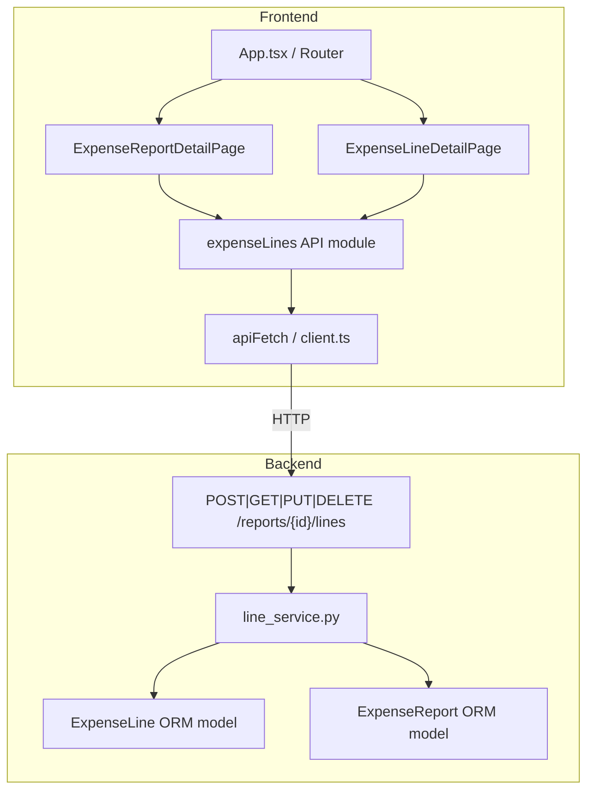
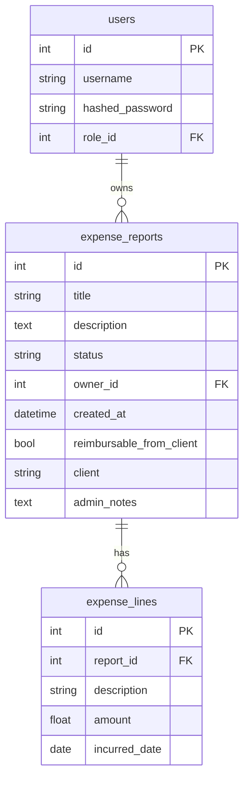

# Design Document: Expense Report Lines

## Overview

This feature adds line-item support to the Expense Report Web App. Each `ExpenseReport` gains a collection of `ExpenseLine` records, each capturing a single expenditure (description, date, amount). The `total_amount` on `ExpenseReport` becomes fully computed server-side as the sum of its lines — it is no longer entered manually.

The change touches every layer of the stack:

- **Backend**: new ORM model, Pydantic schemas, router, and service layer. `total_amount` is removed from the `expense_reports` table entirely and computed on the fly via a `SUM` query at read time.
- **Frontend**: new detail page for reports (with a lines table), new detail page for creating/editing a line, a new API module, updated TypeScript types, and three new routes.

The design follows all existing conventions: API-first (Pydantic schemas defined before implementation), SQLAlchemy ORM with SQLite, FastAPI session-cookie auth, React + MUI + TypeScript frontend, and Hypothesis property-based tests on the backend.

---

## Architecture



**Request flow for line mutation:**

1. Frontend calls `apiFetch` → `POST /reports/{id}/lines`
2. `lines.py` router authenticates via `get_current_user`, validates body via Pydantic, delegates to `line_service`
3. `line_service` checks ownership and report status, persists the `ExpenseLine`, and commits
4. On the next `GET /reports` or `GET /reports/{id}`, `report_service` computes `total_amount` as `SUM(expense_lines.amount)` for each report — nothing is written back to `expense_reports`
5. Router returns the response with the computed `total_amount`

---

## Components and Interfaces

### Backend Components

| File | Responsibility |
|---|---|
| `backend/app/models/expense_line.py` | SQLAlchemy ORM model for `ExpenseLine` |
| `backend/app/schemas/expense_line.py` | Pydantic request/response schemas |
| `backend/app/routers/lines.py` | FastAPI router, mounted under `/reports` |
| `backend/app/services/line_service.py` | Business logic: CRUD + ownership/status checks |
| `backend/app/services/report_service.py` | Extended with on-the-fly `total_amount` computation in report queries |
| `backend/app/models/expense_report.py` | Extended with `lines` relationship |
| `backend/app/schemas/expense_report.py` | `total_amount` removed from Create/Update |
| `backend/app/main.py` | Register `lines` router |

### Frontend Components

| File | Responsibility |
|---|---|
| `frontend/src/api/expenseLines.ts` | Typed `apiFetch` wrappers for all line endpoints |
| `frontend/src/types/expenseReport.ts` | Add `ExpenseLine*` TypeScript interfaces |
| `frontend/src/pages/ExpenseReportDetailPage.tsx` | Report detail + read-only lines table + Add/Edit/Delete controls |
| `frontend/src/pages/ExpenseLineDetailPage.tsx` | Create / edit form for a single line |
| `frontend/src/hooks/useExpenseLines.ts` | State management hook for lines within a report |
| `frontend/src/App.tsx` | Add three new protected routes |

---

## Data Models

### Entity-Relationship Diagram



### `ExpenseLine` ORM Model (`backend/app/models/expense_line.py`)

```python
class ExpenseLine(Base):
    __tablename__ = "expense_lines"

    id: Mapped[int] = mapped_column(Integer, primary_key=True, autoincrement=True)
    report_id: Mapped[int] = mapped_column(
        Integer, ForeignKey("expense_reports.id", ondelete="CASCADE"), nullable=False
    )
    description: Mapped[str] = mapped_column(Text, nullable=False)
    amount: Mapped[float] = mapped_column(Float, nullable=False)
    incurred_date: Mapped[date] = mapped_column(Date, nullable=False)

    report: Mapped["ExpenseReport"] = relationship("ExpenseReport", back_populates="lines")
```

`ondelete="CASCADE"` at the DB level ensures lines are removed when the parent report is deleted, satisfying Requirement 1.5.

### `ExpenseReport` model changes

The `total_amount` column is **removed** from the `ExpenseReport` ORM model and the `expense_reports` table. It is no longer stored.

Add the `lines` relationship:

```python
# Add to ExpenseReport class:
lines: Mapped[List["ExpenseLine"]] = relationship(
    "ExpenseLine", back_populates="report", cascade="all, delete-orphan"
)
```

### `total_amount` in API responses

`total_amount` is retained in `ExpenseReportResponse` as a computed field. It is populated at query time by `report_service` using a `SUM` aggregation:

```python
from sqlalchemy import func
from app.models.expense_line import ExpenseLine

def _compute_total(db: Session, report_id: int) -> float:
    result = db.query(func.sum(ExpenseLine.amount)).filter(
        ExpenseLine.report_id == report_id
    ).scalar()
    return result or 0.0
```

The `_to_response` helper in `reports.py` calls `_compute_total` when building each `ExpenseReportResponse`. No value is written back to the database.

---

## Backend Design

### Pydantic Schemas (`backend/app/schemas/expense_line.py`)

```python
class ExpenseLineCreate(BaseModel):
    description: str = Field(..., min_length=1)
    amount: float = Field(..., gt=0)
    incurred_date: date  # ISO 8601 date string in request, e.g. "2026-04-23"

class ExpenseLineUpdate(BaseModel):
    description: Optional[str] = Field(default=None, min_length=1)
    amount: Optional[float] = Field(default=None, gt=0)
    incurred_date: Optional[date] = Field(default=None)

    @model_validator(mode="after")
    def at_least_one_field(self) -> "ExpenseLineUpdate":
        if all(v is None for v in [self.description, self.amount, self.incurred_date]):
            raise ValueError("At least one field must be provided for update")
        return self

class ExpenseLineResponse(BaseModel):
    id: int
    report_id: int
    description: str
    amount: float
    incurred_date: date  # serialized as "YYYY-MM-DD"

    model_config = ConfigDict(from_attributes=True)
```

**Date handling**: `incurred_date` is stored as a SQL `Date` column (no time component). The API accepts and returns ISO 8601 date strings (`"YYYY-MM-DD"`). The frontend converts these to human-readable local-timezone strings using `Intl.DateTimeFormat`.

### REST API Contract

All endpoints are nested under the existing `/reports` prefix. The router file is `backend/app/routers/lines.py` and is registered in `main.py` as:

```python
app.include_router(lines.router, prefix="/reports")
```

#### `POST /reports/{report_id}/lines`

Creates a new expense line for the specified report.

- **Auth**: `get_current_user` (session cookie required)
- **Request body**: `ExpenseLineCreate`
- **Success**: `201 Created` → `ExpenseLineResponse`
- **Errors**:
  - `401` — unauthenticated
  - `403` — caller is not the report owner
  - `404` — report not found
  - `409` — report status is `Submitted` or `Scheduled for Payment`
  - `422` — Pydantic validation failure (missing/invalid fields)

#### `GET /reports/{report_id}/lines`

Returns all expense lines for the specified report.

- **Auth**: `get_current_user`
- **Success**: `200 OK` → `List[ExpenseLineResponse]`
- **Errors**:
  - `401` — unauthenticated
  - `403` — caller is not the owner and does not have Admin role
  - `404` — report not found

#### `PUT /reports/{report_id}/lines/{line_id}`

Updates an existing expense line.

- **Auth**: `get_current_user`
- **Request body**: `ExpenseLineUpdate` (partial — only provided fields are applied)
- **Success**: `200 OK` → `ExpenseLineResponse`
- **Errors**:
  - `401` — unauthenticated
  - `403` — caller is not the report owner
  - `404` — report or line not found, or line does not belong to report
  - `409` — report status is `Submitted` or `Scheduled for Payment`
  - `422` — Pydantic validation failure

#### `DELETE /reports/{report_id}/lines/{line_id}`

Deletes an expense line.

- **Auth**: `get_current_user`
- **Success**: `204 No Content`
- **Errors**:
  - `401` — unauthenticated
  - `403` — caller is not the report owner
  - `404` — report or line not found, or line does not belong to report
  - `409` — report status is `Submitted` or `Scheduled for Payment`

### Service Layer (`backend/app/services/line_service.py`)

```python
LOCKED_STATUSES = ("Submitted", "Scheduled for Payment")
EDITABLE_STATUSES = ("In Progress", "Rejected")

def _get_report_or_404(db, report_id) -> ExpenseReport: ...
def _get_line_or_404(db, report_id, line_id) -> ExpenseLine: ...
def _assert_owner(report, current_user): ...  # raises 403
def _assert_editable(report): ...             # raises 409

def create_line(db, report_id, data, current_user) -> ExpenseLine:
    report = _get_report_or_404(db, report_id)
    _assert_owner(report, current_user)
    _assert_editable(report)
    line = ExpenseLine(report_id=report_id, **data.model_dump())
    db.add(line)
    db.commit()
    db.refresh(line)
    return line

def list_lines(db, report_id, current_user) -> list[ExpenseLine]:
    report = _get_report_or_404(db, report_id)
    _assert_read_access(report, current_user)  # owner or admin
    return db.query(ExpenseLine).filter_by(report_id=report_id).order_by(ExpenseLine.id).all()

def update_line(db, report_id, line_id, data, current_user) -> ExpenseLine:
    report = _get_report_or_404(db, report_id)
    _assert_owner(report, current_user)
    _assert_editable(report)
    line = _get_line_or_404(db, report_id, line_id)
    for field, value in data.model_dump(exclude_none=True).items():
        setattr(line, field, value)
    db.commit()
    db.refresh(line)
    return line

def delete_line(db, report_id, line_id, current_user) -> None:
    report = _get_report_or_404(db, report_id)
    _assert_owner(report, current_user)
    _assert_editable(report)
    line = _get_line_or_404(db, report_id, line_id)
    db.delete(line)
    db.commit()
```

### `ExpenseReportCreate` / `ExpenseReportUpdate` Changes

`total_amount` is removed from both schemas — it is no longer a stored field. The `ExpenseReportResponse` retains `total_amount` as a read-only computed field populated at query time.

**Migration note**: The database will be reset as part of this feature deployment. No migration of existing data is required.

---

## Frontend Design

**Migration note**: The database will be reset as part of this feature deployment. No migration of existing data is required.

The `list_lines` service function checks:
1. If `current_user.id == report.owner_id` → allow
2. Else if `current_user.role.name == "Admin"` → allow
3. Else → raise `HTTPException(403)`

This mirrors the pattern used in `list_reports` in `reports.py`.

### `ExpenseReportCreate` / `ExpenseReportUpdate` Changes

`total_amount` is removed from both schemas. The `ExpenseReportCreate` schema no longer requires it; the field is computed on the backend. The `ExpenseReportUpdate` schema also drops `total_amount`. Existing tests that pass `total_amount` in create payloads will need to be updated.

### Access Control for `GET /reports/{report_id}/lines`

### TypeScript Types (`frontend/src/types/expenseReport.ts`)

Add the following interfaces:

```typescript
export interface ExpenseLineCreate {
  description: string;
  amount: number;
  incurred_date: string; // ISO 8601 date: "YYYY-MM-DD"
}

export interface ExpenseLineUpdate {
  description?: string;
  amount?: number;
  incurred_date?: string;
}

export interface ExpenseLineResponse {
  id: number;
  report_id: number;
  description: string;
  amount: number;
  incurred_date: string; // "YYYY-MM-DD"
}
```

Remove `total_amount` from `ExpenseReportCreate` and `ExpenseReportUpdate`.

### API Module (`frontend/src/api/expenseLines.ts`)

```typescript
export async function listLines(reportId: number): Promise<ExpenseLineResponse[]>
export async function createLine(reportId: number, data: ExpenseLineCreate): Promise<ExpenseLineResponse>
export async function updateLine(reportId: number, lineId: number, data: ExpenseLineUpdate): Promise<ExpenseLineResponse>
export async function deleteLine(reportId: number, lineId: number): Promise<void>
```

All functions use `apiFetch` from `client.ts`. `deleteLine` handles the `204 No Content` response (no JSON body) using the same pattern as `deleteReport` in `reports.ts`.

### Hook (`frontend/src/hooks/useExpenseLines.ts`)

```typescript
interface UseExpenseLinesReturn {
  lines: ExpenseLineResponse[];
  isLoading: boolean;
  error: string | null;
  refetch: () => void;
  handleCreate: (data: ExpenseLineCreate) => Promise<ExpenseLineResponse>;
  handleUpdate: (lineId: number, data: ExpenseLineUpdate) => Promise<void>;
  handleDelete: (lineId: number) => Promise<void>;
}

export function useExpenseLines(reportId: number): UseExpenseLinesReturn
```

The hook fetches lines on mount and after each mutation. It exposes `refetch` so `ExpenseReportDetailPage` can refresh the report (to get the updated `total_amount`) after a line mutation.

### Routing Changes (`frontend/src/App.tsx`)

Three new protected routes are added:

```tsx
<Route path="/reports/:reportId" element={<ExpenseReportDetailPage />} />
<Route path="/reports/:reportId/lines/new" element={<ExpenseLineDetailPage />} />
<Route path="/reports/:reportId/lines/:lineId/edit" element={<ExpenseLineDetailPage />} />
```

The existing `/reports/:reportId/edit` route (for editing the report itself) is retained unchanged.

### `ExpenseReportDetailPage` (`frontend/src/pages/ExpenseReportDetailPage.tsx`)

**Purpose**: Displays a single report's fields and its lines table.

**Layout**:
- Report header: title, status badge, description, `total_amount` (read-only, currency-formatted), reimbursable/client info
- `Expense_Lines_Section`: MUI `Table` with columns Description, Amount, Date, and (conditionally) Actions
- Add button: shown only when `report.status` is `"In Progress"` or `"Rejected"` and `currentUser.id === report.owner_id`
- Per-row Edit and Delete icon buttons: shown under the same condition
- Empty state: MUI `Typography` message when `lines.length === 0`
- Subtotal row at the bottom of the table showing the sum of all line amounts

**MUI components**: `Table`, `TableHead`, `TableBody`, `TableRow`, `TableCell`, `TableFooter`, `IconButton` (Edit/Delete icons from `@mui/icons-material`), `Button` (Add), `Chip` (status badge), `Dialog`/`DialogActions` (delete confirmation).

**Delete confirmation**: A MUI `Dialog` is shown when the Delete button is clicked. On confirm, `handleDelete` is called; on cancel, the dialog closes with no action.

**Navigation**:
- Add button → `navigate(\`/reports/${reportId}/lines/new\`)`
- Edit button → `navigate(\`/reports/${reportId}/lines/${lineId}/edit\`)`
- After successful delete → stay on page, lines list refreshes

**Data fetching**: The page fetches the report via `GET /reports` (filtering by id from the existing `useReports` hook or a dedicated `getReport` call) and lines via `useExpenseLines(reportId)`.

### `ExpenseLineDetailPage` (`frontend/src/pages/ExpenseLineDetailPage.tsx`)

**Purpose**: Create or edit a single expense line. Operates in two modes determined by the presence of `:lineId` in the URL.

**Create mode** (`/reports/:reportId/lines/new`):
- Empty form with Description, Amount, and Date fields
- Submit calls `createLine(reportId, formData)`
- On success → `navigate(\`/reports/${reportId}\`)`

**Edit mode** (`/reports/:reportId/lines/:lineId/edit`):
- Form pre-populated by fetching the line from `GET /reports/{reportId}/lines` and finding the matching entry
- Submit calls `updateLine(reportId, lineId, formData)`
- On success → `navigate(\`/reports/${reportId}\`)`

**Form fields**:
- `description`: MUI `TextField`, required, `min_length=1`
- `amount`: MUI `TextField` with `type="number"`, required, must be `> 0`
- `incurred_date`: MUI `DatePicker` from `@mui/x-date-pickers` (or a plain `<input type="date">` if the date-pickers package is not already installed), required, must be a valid calendar date

**Validation**: Client-side validation mirrors server-side Pydantic rules. Server errors (422) are displayed as an `Alert` below the form.

**MUI components**: `TextField`, `Button` (Submit, Cancel), `Alert` (error display), `CircularProgress` (loading state).

**Date display**: `incurred_date` is stored and transmitted as `"YYYY-MM-DD"`. When displaying in the lines table, it is formatted using:

```typescript
function formatIncurredDate(isoDate: string): string {
  // Parse as local date to avoid UTC offset shifting the day
  const [year, month, day] = isoDate.split('-').map(Number);
  const d = new Date(year, month - 1, day);
  return new Intl.DateTimeFormat(undefined, {
    year: 'numeric', month: 'short', day: 'numeric',
  }).format(d);
}
```

Note: `incurred_date` is a calendar date (no time), so it is parsed as a local date (not UTC) to avoid the date shifting by one day due to timezone offset.

---

## Correctness Properties

*A property is a characteristic or behavior that should hold true across all valid executions of a system — essentially, a formal statement about what the system should do. Properties serve as the bridge between human-readable specifications and machine-verifiable correctness guarantees.*

### Property 1: Line creation round-trip preserves all fields

*For any* valid `ExpenseLineCreate` payload (non-empty description, positive amount, valid date), submitting it via `POST /reports/{id}/lines` and then retrieving lines via `GET /reports/{id}/lines` SHALL return a record containing the same description, amount, and incurred_date.

**Validates: Requirements 1.1, 2.4, 7.5**

### Property 2: Invalid line creation is always rejected

*For any* `ExpenseLineCreate` payload where at least one required field is missing, empty, or invalid (non-positive amount, missing description, missing date), `POST /reports/{id}/lines` SHALL return `422` and the line count for the report SHALL remain unchanged.

**Validates: Requirements 2.5, 2.6**

### Property 3: Line update round-trip preserves updated fields

*For any* existing `ExpenseLine` and any valid `ExpenseLineUpdate` payload, submitting it via `PUT /reports/{id}/lines/{line_id}` and then retrieving the line SHALL return a record where the updated fields match the submitted values and unchanged fields retain their original values.

**Validates: Requirements 3.4**

### Property 4: Non-owner mutation is always forbidden

*For any* `ExpenseLine` owned by user A, any `PUT` or `DELETE` request to that line made by an authenticated user B (where B is not A and B does not have Admin role) SHALL return `403 Forbidden` and the line SHALL remain unchanged.

**Validates: Requirements 3.6, 4.4, 8.3**

### Property 5: Status locking prevents all line mutations

*For any* `ExpenseReport` with status `Submitted` or `Scheduled for Payment`, any `POST`, `PUT`, or `DELETE` request to its lines made by the owner SHALL return `409 Conflict` and the lines collection SHALL remain unchanged.

**Validates: Requirements 3.7, 4.5**

### Property 6: Total amount always equals the sum of line amounts

*For any* sequence of line create, update, and delete operations on an `ExpenseReport`, the `total_amount` field on the report returned by `GET /reports` SHALL always equal the arithmetic sum of all current `ExpenseLine.amount` values for that report (or `0.00` when there are no lines).

**Validates: Requirements 5.1, 5.2, 5.3, 5.4**

### Property 7: Line deletion removes the line

*For any* existing `ExpenseLine`, after a successful `DELETE /reports/{id}/lines/{line_id}`, the line SHALL no longer appear in `GET /reports/{id}/lines` and the report's `total_amount` SHALL reflect the removal.

**Validates: Requirements 4.3, 5.1**

### Property 8: Cascade delete removes all lines

*For any* `ExpenseReport` with N lines, deleting the report via `DELETE /reports/{id}` SHALL result in all N lines being permanently removed (no orphaned `expense_lines` rows remain in the database).

**Validates: Requirements 1.5**

### Property 9: Unauthenticated requests to line endpoints are always rejected

*For any* line endpoint (`POST`, `GET`, `PUT`, `DELETE`), a request made without a valid session cookie SHALL return `401 Unauthorized`.

**Validates: Requirements 7.9**

### Property 10: Admin can read lines for any report

*For any* `ExpenseReport` owned by user A, an authenticated user with Admin role SHALL receive `200 OK` with the lines list when calling `GET /reports/{id}/lines`, regardless of ownership.

**Validates: Requirements 8.1**

### Property 11: Non-owner non-admin cannot read lines

*For any* `ExpenseReport` owned by user A, an authenticated user B with User role (where B ≠ A) SHALL receive `403 Forbidden` when calling `GET /reports/{id}/lines`.

**Validates: Requirements 8.2**

---

## Error Handling

### Backend

| Condition | HTTP Status | Detail message |
|---|---|---|
| No session cookie | 401 | "Not authenticated" |
| Caller is not report owner (mutation) | 403 | "You do not have permission to modify this report" |
| Caller is not owner or admin (read) | 403 | "You do not have permission to view this report's lines" |
| Report not found | 404 | "Report not found" |
| Line not found or wrong report | 404 | "Line not found" |
| Report status is locked | 409 | "Cannot perform this action on a report with status '{status}'" |
| Pydantic validation failure | 422 | FastAPI default validation error body |

All error responses follow the existing `{"detail": "..."}` JSON shape used throughout the app.

### Frontend

- **Network/API errors**: Caught in `useExpenseLines` hook, stored in `error` state, displayed via `ErrorAlert` component (already used on `DashboardPage`).
- **403 on detail page**: Display an inline `Alert` with "You do not have permission to view this report's lines."
- **404 on detail page**: Display an inline `Alert` with "Report not found." and a Back button.
- **409 on line mutation**: Display an inline `Alert` on `ExpenseLineDetailPage` with the server's detail message.
- **422 validation errors**: Display field-level error messages below each form field on `ExpenseLineDetailPage`.

---

## Testing Strategy

### Backend — Unit Tests (`backend/tests/unit/`)

- `test_line_service.py`: Test each service function in isolation using an in-memory SQLite session (same pattern as existing unit tests). Cover:
  - `create_line`: valid creation, 403 for non-owner, 409 for locked status, 404 for missing report
  - `list_lines`: owner access, admin access, non-owner 403
  - `update_line`: valid update, partial update, 403, 409, 404
  - `delete_line`: valid deletion, 403, 409, 404

- `test_report_service.py` (additions): Test `_compute_total`:
  - Returns correct sum with multiple lines, returns `0.0` with zero lines

- `test_expense_line_schemas.py`: Test Pydantic schema validation:
  - `ExpenseLineCreate`: valid payload, missing description, zero amount, negative amount, invalid date
  - `ExpenseLineUpdate`: valid partial update, all-None rejection

### Backend — Integration Tests (`backend/tests/integration/test_lines.py`)

Following the `httpx.AsyncClient` + `ASGITransport` pattern from `test_reports.py`:

- `POST /reports/{id}/lines`: success 201, unauthenticated 401, non-owner 403, locked status 409, missing fields 422, non-positive amount 422
- `GET /reports/{id}/lines`: success 200 (owner), admin 200, non-owner 403, unauthenticated 401, empty list 200
- `PUT /reports/{id}/lines/{id}`: success 200, non-owner 403, locked 409, invalid payload 422, line not found 404
- `DELETE /reports/{id}/lines/{id}`: success 204, non-owner 403, locked 409, line not found 404

### Backend — Property Tests (`backend/tests/property/test_lines_properties.py`)

Using Hypothesis with `@given` and `@settings(max_examples=100)`. Each property test corresponds to a Correctness Property above:

- **Property 1**: Line creation round-trip — generate random description/amount/date, POST, GET, assert fields match
- **Property 2**: Invalid creation rejected — generate payloads with missing/invalid fields, assert 422 and count unchanged
- **Property 3**: Line update round-trip — create a line, generate random update payload, PUT, GET, assert updated fields
- **Property 4**: Non-owner mutation forbidden — generate two users, create line as user A, attempt PUT/DELETE as user B, assert 403
- **Property 5**: Status locking — create line, transition report to locked status, attempt PUT/DELETE as owner, assert 409
- **Property 6**: Total amount invariant — generate N lines with random amounts, assert `total_amount == sum(amounts)` after each mutation
- **Property 7**: Line deletion removes line — create line, DELETE, GET lines, assert line absent and total updated
- **Property 8**: Cascade delete — create report with N lines, DELETE report, assert no orphaned lines in DB
- **Property 9**: Unauthenticated rejection — call each endpoint without session, assert 401
- **Property 10**: Admin read access — create report as user A, GET lines as admin, assert 200
- **Property 11**: Non-owner non-admin read forbidden — create report as user A, GET lines as user B, assert 403

Tag format for each test: `# Feature: expense-report-lines, Property N: {property_text}`

### Frontend — Unit Tests (Vitest)

- `expenseLines.ts` API module: mock `apiFetch`, test each function's URL construction and method
- `useExpenseLines.ts` hook: mock API module, test state transitions (loading, success, error)
- `formatIncurredDate` utility: test with various date strings, verify human-readable output and no raw ISO strings
- `ExpenseReportDetailPage`: render with mock data, verify table columns, empty state, Add/Edit/Delete button visibility based on status and ownership
- `ExpenseLineDetailPage`: render in create mode (empty form), render in edit mode (pre-populated), form submission, error display

### Testing Notes

- Per workspace rules (`testing-strategy.md`), all testing tasks are **required** — no test tasks are marked optional.
- Backend requires 100% coverage across `backend/app/`.
- Frontend requires 100% coverage for all utility functions in `frontend/src/`.
- Property tests run with `max_examples=100` minimum.
- Pre-compute bcrypt hashes at module level in property tests (following the pattern in `test_reports_properties.py`) to keep test execution time reasonable.
