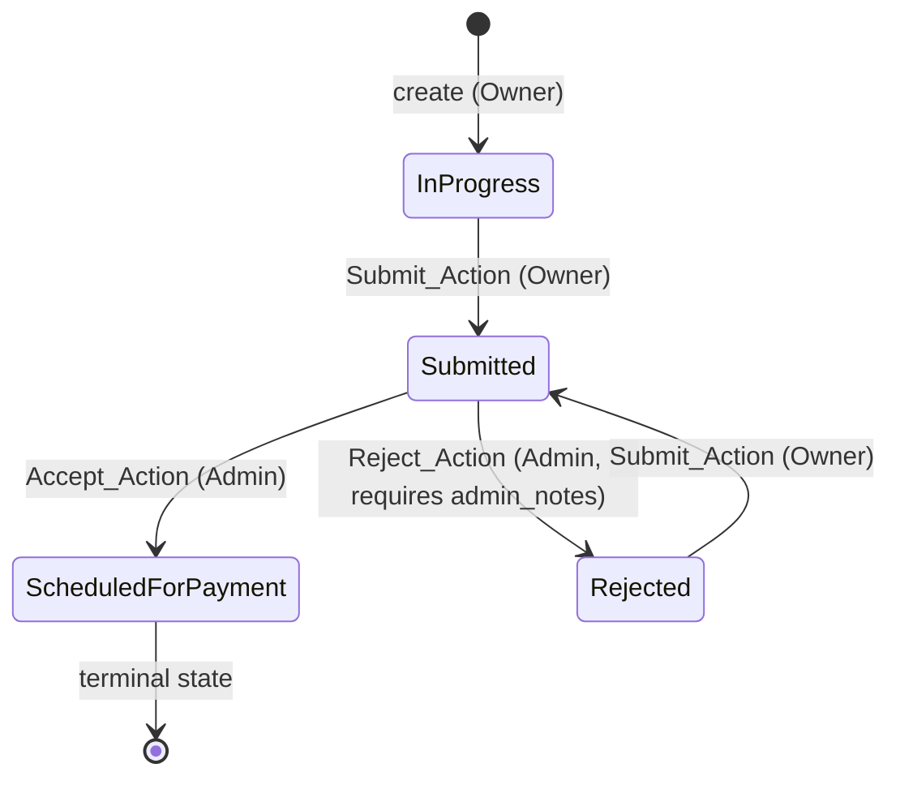

# Design Document: Expense Report Status Lifecycle

## Overview

This feature introduces a full status lifecycle for expense reports, replacing the static `Pending` status with a four-state machine: **In Progress → Submitted → Scheduled for Payment** (or **Rejected → Submitted** for the resubmission path). It adds role-based access control (Admin vs. User), a `StatusAuditLog` table that records every status change atomically, and the frontend controls that surface the right actions to the right users at each stage.

The design extends the existing layered architecture without restructuring it: a new `status_service.py` handles all transition logic, a new `StatusAuditLog` ORM model captures history, and the existing `report_service.py` is updated to write the initial audit entry on creation. The frontend gains conditional action buttons on `ReportCard` and a reject dialog.

### Key Design Decisions

- **Atomic transactions**: Every status change and its corresponding audit log write happen in a single SQLAlchemy transaction. If either fails, both are rolled back (Requirement 11.5).
- **Server-side timestamps**: All `changed_at` values are generated with `datetime.now(timezone.utc)` in the service layer; no client-supplied timestamps are accepted.
- **Role dependency**: The role system (`role_id` on `User`, `Role` model) is being merged from the `feature/user-roles-and-logout` branch. This design assumes that merge has occurred and that `get_current_user` can be extended to expose the user's role. The `User` model will need a `role_id` FK and a `role` relationship.
- **Status as a string enum**: Status values are stored as plain strings in SQLite (matching the existing pattern) and validated in the service layer rather than at the DB level, keeping migrations simple.

---

## Architecture

The feature fits cleanly into the existing layered architecture:

```
┌─────────────────────────────────────────────────────────────┐
│  Frontend (React + MUI + TypeScript)                        │
│  ┌──────────────┐  ┌──────────────────────────────────────┐ │
│  │ DashboardPage│  │ ReportCard (updated)                 │ │
│  │ (updated)    │  │  - Status badge                      │ │
│  │              │  │  - Conditional action buttons        │ │
│  └──────────────┘  │  - Reject dialog                     │ │
│                    └──────────────────────────────────────┘ │
│  frontend/src/api/reports.ts (new action functions)         │
└────────────────────────┬────────────────────────────────────┘
                         │ HTTP (JSON, session cookie)
┌────────────────────────▼────────────────────────────────────┐
│  FastAPI Routers (backend/app/routers/reports.py)           │
│  POST /reports/{id}/submit                                  │
│  POST /reports/{id}/accept                                  │
│  POST /reports/{id}/reject                                  │
│  PUT  /reports/{id}                                         │
│  DELETE /reports/{id}                                       │
└────────────────────────┬────────────────────────────────────┘
                         │
┌────────────────────────▼────────────────────────────────────┐
│  Service Layer                                              │
│  ┌──────────────────────┐  ┌──────────────────────────────┐ │
│  │ report_service.py    │  │ status_service.py (new)      │ │
│  │ (updated)            │  │  submit_report()             │ │
│  │  create_report()     │  │  accept_report()             │ │
│  │  update_report()     │  │  reject_report()             │ │
│  │  delete_report()     │  └──────────────────────────────┘ │
│  └──────────────────────┘                                   │
└────────────────────────┬────────────────────────────────────┘
                         │ SQLAlchemy ORM
┌────────────────────────▼────────────────────────────────────┐
│  ORM Models                                                 │
│  ExpenseReport (updated: status default "In Progress")      │
│  StatusAuditLog (new)                                       │
│  User (role_id FK added by roles branch merge)              │
└────────────────────────┬────────────────────────────────────┘
                         │
┌────────────────────────▼────────────────────────────────────┐
│  SQLite Database (via Alembic migration)                    │
└─────────────────────────────────────────────────────────────┘
```

---

## Status State Machine

The four valid states and their allowed transitions:



### Transition Table

| From State           | Action         | Actor | To State               | Preconditions                        |
|----------------------|----------------|-------|------------------------|--------------------------------------|
| In Progress          | Submit_Action  | Owner | Submitted              | All required fields populated        |
| Submitted            | Accept_Action  | Admin | Scheduled for Payment  | —                                    |
| Submitted            | Reject_Action  | Admin | Rejected               | `admin_notes` non-empty              |
| Rejected             | Submit_Action  | Owner | Submitted              | All required fields populated        |

Any other (state, action) combination returns **409 Conflict**.

### Editable States

| State                 | Owner can update/delete | Admin can accept/reject |
|-----------------------|------------------------|------------------------|
| In Progress           | ✅                      | ❌                      |
| Submitted             | ❌ (409)                | ✅                      |
| Rejected              | ✅                      | ❌                      |
| Scheduled for Payment | ❌ (409)                | ❌                      |

---

## Components and Interfaces

### Backend: New and Updated Files

#### `backend/app/models/status_audit_log.py` (new)

New ORM model for the audit log table.

```python
class StatusAuditLog(Base):
    __tablename__ = "status_audit_log"

    id: Mapped[int]                  # PK, autoincrement
    expense_report_id: Mapped[int]   # FK → expense_reports.id, NOT NULL, indexed
    status: Mapped[str]              # new status value, String(50), NOT NULL
    changed_at: Mapped[datetime]     # UTC datetime, NOT NULL
```

#### `backend/app/models/expense_report.py` (updated)

- Change `status` column default from `"Pending"` to `"In Progress"`.
- Add back-reference relationship to `StatusAuditLog`.

#### `backend/app/models/__init__.py` (updated)

Import `StatusAuditLog` so `Base.metadata.create_all()` discovers the new table.

#### `backend/app/services/status_service.py` (new)

Contains all status transition logic. Each function:
1. Loads the report (raises 404 if not found).
2. Checks actor authorization (raises 403 if wrong role/ownership).
3. Validates the current status (raises 409 if invalid transition).
4. Applies any field-level validation (raises 422 if preconditions unmet).
5. Updates the report status and writes an audit entry **in the same transaction**.
6. Commits and returns the updated report.

```python
def submit_report(db: Session, report_id: int, current_user: User) -> ExpenseReport: ...
def accept_report(db: Session, report_id: int, current_user: User) -> ExpenseReport: ...
def reject_report(db: Session, report_id: int, admin_notes: str, current_user: User) -> ExpenseReport: ...
```

#### `backend/app/services/report_service.py` (updated)

- `create_report()`: change `status="Pending"` to `status="In Progress"`, and write an initial `StatusAuditLog` entry in the same transaction.
- Add `update_report(db, report_id, data, current_user)`: validates ownership and that the report is in an editable state (`In Progress` or `Rejected`); returns 403 for non-owners, 409 for read-only states.
- Add `delete_report(db, report_id, current_user)`: same ownership and state checks; returns 403 for non-owners, 409 for read-only states.

#### `backend/app/routers/reports.py` (updated)

Add five new endpoints (see API Endpoints section below). The router remains a thin HTTP adapter — all logic stays in the service layer.

#### `backend/app/schemas/expense_report.py` (updated)

Add three new schemas (see Data Models section below).

#### `backend/app/dependencies.py` (updated)

Add a `get_current_admin` dependency that calls `get_current_user` and then checks `user.role.name == "Admin"`, raising 403 if not.

### Frontend: New and Updated Files

#### `frontend/src/api/reports.ts` (updated)

Add five new API functions:

```typescript
submitReport(reportId: number): Promise<ExpenseReportResponse>
acceptReport(reportId: number): Promise<ExpenseReportResponse>
rejectReport(reportId: number, adminNotes: string): Promise<ExpenseReportResponse>
updateReport(reportId: number, data: ExpenseReportUpdate): Promise<ExpenseReportResponse>
deleteReport(reportId: number): Promise<void>
```

#### `frontend/src/types/expenseReport.ts` (updated)

Add `ExpenseReportUpdate` interface and `StatusAuditLogEntry` interface.

#### `frontend/src/types/auth.ts` (updated)

Add `role` field to `UserResponse` (once the roles branch is merged):

```typescript
export interface UserResponse {
  id: number;
  username: string;
  role: string;  // "Admin" | "User"
}
```

#### `frontend/src/components/ReportCard.tsx` (updated)

- Accept `currentUser: UserResponse` prop.
- Show a colored status `Chip` (color varies by status).
- Show `admin_notes` prominently when status is `Rejected`.
- Render conditional action buttons based on `report.status` and `currentUser.role`:
  - **In Progress, owner**: Edit button, Delete button, Submit button.
  - **Submitted, admin**: Accept button, Reject button.
  - **Rejected, owner**: Edit button, Delete button, Submit button.
  - **Submitted/Scheduled for Payment, owner**: no action buttons (read-only).
- Clicking Reject opens a `RejectDialog`.

#### `frontend/src/components/RejectDialog.tsx` (new)

MUI `Dialog` component that:
- Prompts the admin for `admin_notes` (required, non-empty).
- Has Cancel and Confirm buttons.
- Disables Confirm until `admin_notes` is non-empty.
- Calls `rejectReport()` on confirm and closes on success or cancel.

#### `frontend/src/pages/DashboardPage.tsx` (updated)

- Read `currentUser` from auth context (or session hook).
- Pass `currentUser` to each `ReportCard`.
- Handle optimistic updates or refetch after action button clicks.

#### `frontend/src/hooks/useReports.ts` (updated)

Add action handlers: `submitReport`, `acceptReport`, `rejectReport`, `updateReport`, `deleteReport` — each calls the corresponding API function and updates local state on success.

---

## API Endpoints

### New Endpoints

#### `POST /reports/{id}/submit`

Transitions a report from `In Progress` or `Rejected` to `Submitted`.

- **Auth**: Session cookie required (any authenticated user).
- **Authorization**: Must be the report owner (403 otherwise).
- **State check**: Report must be in `In Progress` or `Rejected` (409 otherwise).
- **Validation**: All required fields (`title`, `total_amount`) must be populated (422 otherwise).
- **Response 200**: `ExpenseReportResponse` with updated status.
- **Response 403**: Not the owner.
- **Response 404**: Report not found.
- **Response 409**: Invalid state for this transition.

#### `POST /reports/{id}/accept`

Transitions a report from `Submitted` to `Scheduled for Payment`.

- **Auth**: Session cookie required.
- **Authorization**: Must be an Admin (403 otherwise).
- **State check**: Report must be `Submitted` (409 otherwise).
- **Response 200**: `ExpenseReportResponse` with updated status.
- **Response 403**: Not an admin.
- **Response 404**: Report not found.
- **Response 409**: Invalid state for this transition.

#### `POST /reports/{id}/reject`

Transitions a report from `Submitted` to `Rejected`.

- **Auth**: Session cookie required.
- **Authorization**: Must be an Admin (403 otherwise).
- **State check**: Report must be `Submitted` (409 otherwise).
- **Request body**: `RejectRequest { admin_notes: str }` — `admin_notes` must be non-empty (422 otherwise).
- **Response 200**: `ExpenseReportResponse` with updated status and persisted `admin_notes`.
- **Response 403**: Not an admin.
- **Response 404**: Report not found.
- **Response 409**: Invalid state for this transition.
- **Response 422**: `admin_notes` is empty or missing.

#### `PUT /reports/{id}`

Updates editable fields on a report.

- **Auth**: Session cookie required.
- **Authorization**: Must be the report owner (403 otherwise).
- **State check**: Report must be in `In Progress` or `Rejected` (409 otherwise).
- **Request body**: `ExpenseReportUpdate` (all fields optional).
- **Response 200**: `ExpenseReportResponse` with updated fields.
- **Response 403**: Not the owner.
- **Response 404**: Report not found.
- **Response 409**: Report is in a read-only state.
- **Response 422**: Validation failure (e.g., `total_amount <= 0`).

#### `DELETE /reports/{id}`

Deletes a report.

- **Auth**: Session cookie required.
- **Authorization**: Must be the report owner (403 otherwise).
- **State check**: Report must be in `In Progress` or `Rejected` (409 otherwise).
- **Response 204**: No content.
- **Response 403**: Not the owner.
- **Response 404**: Report not found.
- **Response 409**: Report is in a read-only state.

---

## Data Models

### New ORM Model: `StatusAuditLog`

```python
# backend/app/models/status_audit_log.py
class StatusAuditLog(Base):
    __tablename__ = "status_audit_log"

    id: Mapped[int] = mapped_column(Integer, primary_key=True, autoincrement=True)
    expense_report_id: Mapped[int] = mapped_column(
        Integer, ForeignKey("expense_reports.id"), nullable=False, index=True
    )
    status: Mapped[str] = mapped_column(String(50), nullable=False)
    changed_at: Mapped[datetime] = mapped_column(DateTime, nullable=False)

    report: Mapped["ExpenseReport"] = relationship("ExpenseReport", back_populates="audit_log")
```

### New Pydantic Schemas

```python
# backend/app/schemas/expense_report.py

class RejectRequest(BaseModel):
    """Request body for POST /reports/{id}/reject."""
    admin_notes: str = Field(..., min_length=1, description="Reason for rejection (required, non-empty)")

class ExpenseReportUpdate(BaseModel):
    """Request body for PUT /reports/{id}. All fields optional."""
    title: Optional[str] = Field(default=None, min_length=1, max_length=255)
    description: Optional[str] = Field(default=None)
    total_amount: Optional[float] = Field(default=None, gt=0)
    reimbursable_from_client: Optional[bool] = Field(default=None)
    client: Optional[str] = Field(default=None)

    @model_validator(mode="after")
    def validate_client(self) -> "ExpenseReportUpdate":
        if self.reimbursable_from_client and not self.client:
            raise ValueError("client is required when reimbursable_from_client is true")
        if self.client is not None:
            from app.constants import CLIENTS
            if self.client not in CLIENTS:
                raise ValueError(f"client must be one of: {CLIENTS}")
        return self

class StatusAuditLogEntry(BaseModel):
    """Response schema for a single audit log entry."""
    id: int
    expense_report_id: int
    status: str
    changed_at: datetime

    model_config = ConfigDict(from_attributes=True)
```

### Updated TypeScript Types

```typescript
// frontend/src/types/expenseReport.ts

export interface ExpenseReportUpdate {
  title?: string;
  description?: string;
  total_amount?: number;
  reimbursable_from_client?: boolean;
  client?: string;
}

export interface StatusAuditLogEntry {
  id: number;
  expense_report_id: number;
  status: string;
  changed_at: string;  // ISO 8601 UTC
}
```

### Database Migration

A single Alembic migration file (`backend/migrations/versions/YYYYMMDD_HHMM_add_status_lifecycle.py`) performs these steps in order:

1. **Alter `expense_reports.status` default** from `"Pending"` to `"In Progress"`.
2. **Update existing rows**: `UPDATE expense_reports SET status = 'In Progress' WHERE status = 'Pending'`.
3. **Create `status_audit_log` table** with columns: `id`, `expense_report_id` (FK, indexed), `status`, `changed_at`.
4. **Backfill audit entries**: Insert one `StatusAuditLog` row per existing `ExpenseReport`, using `created_at` as `changed_at` and `"In Progress"` as `status`.

---

## Correctness Properties

*A property is a characteristic or behavior that should hold true across all valid executions of a system — essentially, a formal statement about what the system should do. Properties serve as the bridge between human-readable specifications and machine-verifiable correctness guarantees.*

### Property 1: Status Transition Validity

*For any* expense report in any state and any actor attempting any action, the resulting status must be one of the four defined valid transitions, and any attempt at an undefined transition must return 409 Conflict without modifying the report.

**Validates: Requirements 9.1, 9.2, 3.5, 5.3, 6.5**

### Property 2: Audit Log Completeness

*For any* sequence of status changes applied to an expense report (including initial creation), the number of audit log entries for that report must equal the total number of status changes applied, and each entry must record the correct `expense_report_id`, the new `status` value, and a `changed_at` timestamp in UTC.

**Validates: Requirements 11.1, 11.2, 11.4, 11.6**

### Property 3: Owner-Only Edit and Delete Enforcement

*For any* expense report in an editable state (`In Progress` or `Rejected`) and any authenticated user who is not the report's owner, any attempt to update or delete the report must return 403 Forbidden and leave the report unchanged.

**Validates: Requirements 2.4, 2.5, 7.6**

### Property 4: Admin-Only Accept and Reject Enforcement

*For any* expense report in `Submitted` state and any authenticated user who does not have the Admin role, any attempt to accept or reject the report must return 403 Forbidden and leave the report unchanged.

**Validates: Requirements 5.4, 6.6**

### Property 5: Reject Requires Non-Empty Admin Notes

*For any* reject request where `admin_notes` is absent, empty, or composed entirely of whitespace, the reject action must return a validation error (422) and must not change the report's status.

**Validates: Requirements 6.1, 6.2**

### Property 6: Read-Only State Enforcement

*For any* expense report in a read-only state (`Submitted` or `Scheduled for Payment`) and any authenticated user, any attempt to update or delete the report must return 409 Conflict and leave the report unchanged.

**Validates: Requirements 4.1, 4.2, 8.1, 8.2**

### Property 7: Submit Transition Correctness

*For any* valid expense report in `In Progress` or `Rejected` state submitted by its owner, the resulting status must be `Submitted`, and the audit log must contain exactly one new entry recording this transition.

**Validates: Requirements 3.3, 7.5, 11.2**

### Property 8: Dashboard Controls Match Status and Role

*For any* expense report in any state rendered for any user, the set of action controls displayed (Submit, Edit, Delete, Accept, Reject) must exactly match the controls permitted by the state machine and the user's role — no permitted action may be hidden, and no forbidden action may be shown.

**Validates: Requirements 2.3, 3.1, 4.3, 5.1, 7.3, 7.4, 8.3, 10.1**

---

## Error Handling

| Scenario | HTTP Status | Detail |
|---|---|---|
| Invalid status transition | 409 Conflict | `"Cannot perform this action on a report with status '{current_status}'"` |
| Non-owner attempts update/delete | 403 Forbidden | `"You do not have permission to modify this report"` |
| Non-admin attempts accept/reject | 403 Forbidden | `"Admin role required"` |
| Reject with empty `admin_notes` | 422 Unprocessable Entity | Pydantic validation error: `"admin_notes: field required and must be non-empty"` |
| Report not found | 404 Not Found | `"Report not found"` |
| Audit log write failure | 500 Internal Server Error | `"Internal server error"` (transaction rolled back) |
| Unauthenticated request | 401 Unauthorized | `"Not authenticated"` |

All error responses follow the existing FastAPI `{"detail": "..."}` envelope. The global exception handler in `main.py` catches unhandled exceptions and returns 500 without leaking stack traces.

---

## Testing Strategy

This feature uses a dual testing approach: **example-based unit/integration tests** for specific scenarios and **property-based tests** (Hypothesis) for universal correctness properties.

### Backend (pytest + Hypothesis)

#### Unit Tests (`backend/tests/unit/`)

- `test_status_service.py`: Test each transition function in isolation using an in-memory SQLite session. Cover success paths, 403 cases, 409 cases, and the 422 case for reject with empty notes.
- `test_report_service.py` (updated): Test `create_report()` writes an audit entry; test `update_report()` and `delete_report()` enforce state and ownership.
- `test_schemas.py` (updated): Test `RejectRequest` rejects empty/whitespace `admin_notes`; test `ExpenseReportUpdate` validates `total_amount > 0` and client consistency.

#### Integration Tests (`backend/tests/integration/`)

Each new endpoint requires at minimum:
- A success test (correct status code and response shape).
- A failed authorization test (403).
- A failed state test (409).
- A validation failure test (422 where applicable).

Endpoints to cover: `POST /reports/{id}/submit`, `POST /reports/{id}/accept`, `POST /reports/{id}/reject`, `PUT /reports/{id}`, `DELETE /reports/{id}`.

#### Property-Based Tests (`backend/tests/property/`)

Uses **Hypothesis** (already present in the project, as evidenced by `.hypothesis/` directories). Each property test runs a minimum of 100 iterations.

```python
# Tag format: Feature: expense-report-status, Property {N}: {property_text}

# Property 1: Status Transition Validity
@given(
    status=st.sampled_from(["In Progress", "Submitted", "Rejected", "Scheduled for Payment"]),
    action=st.sampled_from(["submit", "accept", "reject"])
)
def test_invalid_transitions_return_409(status, action): ...

# Property 2: Audit Log Completeness
@given(transitions=st.lists(st.sampled_from(VALID_TRANSITION_SEQUENCES), min_size=1, max_size=5))
def test_audit_log_entry_count_equals_transition_count(transitions): ...

# Property 3: Owner-Only Edit Enforcement
@given(report_data=report_strategy(), non_owner=user_strategy())
def test_non_owner_update_delete_returns_403(report_data, non_owner): ...

# Property 4: Admin-Only Accept/Reject Enforcement
@given(report_data=submitted_report_strategy(), non_admin=non_admin_user_strategy())
def test_non_admin_accept_reject_returns_403(report_data, non_admin): ...

# Property 5: Reject Requires Non-Empty Admin Notes
@given(notes=st.one_of(st.just(""), st.just("   "), st.text(alphabet=st.characters(whitelist_categories=("Zs",)))))
def test_reject_with_empty_notes_returns_422(notes): ...

# Property 6: Read-Only State Enforcement
@given(
    status=st.sampled_from(["Submitted", "Scheduled for Payment"]),
    update_data=report_update_strategy()
)
def test_read_only_states_reject_update_delete_with_409(status, update_data): ...

# Property 7: Submit Transition Correctness
@given(
    initial_status=st.sampled_from(["In Progress", "Rejected"]),
    report_data=valid_report_strategy()
)
def test_submit_transitions_to_submitted(initial_status, report_data): ...

# Property 8: Dashboard Controls Match Status and Role
@given(
    report=report_strategy(),
    user_role=st.sampled_from(["Admin", "User"])
)
def test_dashboard_controls_match_state_and_role(report, user_role): ...
```

### Frontend (Vitest)

#### Unit Tests (`frontend/src/`)

- `components/ReportCard.test.tsx`: Test that the correct action buttons are rendered for each (status, role) combination. Test that `admin_notes` is displayed for `Rejected` reports. Test that the status chip renders the correct label.
- `components/RejectDialog.test.tsx`: Test that Confirm is disabled when `admin_notes` is empty. Test that Confirm is enabled when `admin_notes` is non-empty. Test that the dialog calls `onConfirm` with the correct notes.
- `api/reports.test.ts`: Test that `submitReport`, `acceptReport`, `rejectReport`, `updateReport`, `deleteReport` call the correct endpoints with the correct method and body.
- `hooks/useReports.test.ts` (updated): Test that action handlers update local state on success.

#### Integration Tests

- `pages/DashboardPage.test.tsx` (updated): Test that `currentUser` is passed to `ReportCard` and that action buttons trigger the correct API calls.

### Test Coverage Requirements

Per the project testing rules:
- 100% coverage across all backend source files in `backend/app/`.
- 100% coverage for all utility functions in `frontend/src/`.
- All testing tasks are required (not optional).
- Property-based tests run a minimum of 100 iterations each.
