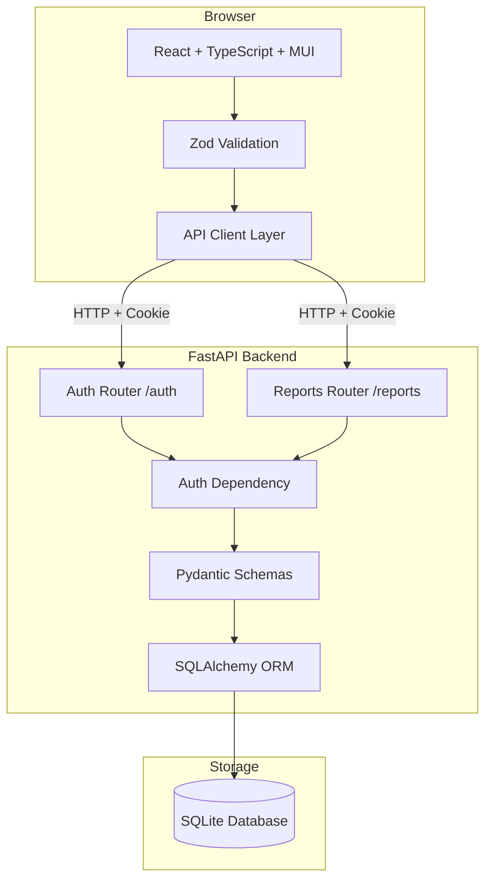

# Design Document: Expense Report Web App

## Overview

The Expense Report Web App is a full-stack web application built with a React/TypeScript frontend and a Python FastAPI backend backed by SQLite. Users authenticate with a username and password, view their expense reports on a dashboard, and submit new reports. All submitted reports are saved with a `Pending` status.

The system follows an API-first approach: OpenAPI contracts are defined before any implementation. The frontend communicates exclusively through a typed API client layer; components never call `fetch` directly. Server-side validation via Pydantic is authoritative; client-side Zod validation is additive.

### Key Design Decisions

- **Session-based authentication** using HTTP-only cookies. This avoids storing tokens in `localStorage` (XSS risk) and keeps the auth flow simple for a single-server deployment.
- **SQLite + SQLAlchemy** for persistence. Appropriate for a single-user or small-team deployment; the ORM layer makes a future migration to PostgreSQL straightforward.
- **Contract-first API**: Pydantic schemas define the API surface. FastAPI auto-generates `/docs` and `/openapi.json` from these schemas.
- **Zod mirrors Pydantic**: Frontend TypeScript types and Zod schemas are derived from the same field definitions as the backend Pydantic models, keeping validation logic consistent across the stack.

---

## Architecture



**Request flow:**

1. Browser sends HTTP request with session cookie.
2. FastAPI auth dependency validates the session on every protected route; returns `401` if invalid.
3. Route handler validates the request body via Pydantic schema.
4. Handler calls SQLAlchemy ORM to read/write SQLite.
5. Response is serialized via Pydantic response schema and returned as JSON.
6. Frontend API client receives the response; Zod validates the shape before passing data to React components.

---

## Components and Interfaces

### Backend Routers

| Router | Prefix | Responsibility |
|---|---|---|
| `auth.py` | `/auth` | Login, logout, session management |
| `reports.py` | `/reports` | List and create expense reports |

### Frontend Pages

| Page Component | Route | Description |
|---|---|---|
| `LoginPage` | `/login` | Username/password form |
| `DashboardPage` | `/` | Lists user's expense reports; "Create New Report" button |
| `CreateReportPage` | `/reports/new` | Form to create a new expense report |

### Frontend Shared Components

| Component | Description |
|---|---|
| `ProtectedRoute` | Wrapper that redirects unauthenticated users to `/login` |
| `ReportCard` | MUI Card displaying a single expense report's title, purpose, amount, and status |
| `ReportForm` | Controlled MUI form with Zod validation for Title, Purpose, Total Amount |
| `ErrorAlert` | MUI Alert for displaying validation or API errors |
| `EmptyState` | Displayed on Dashboard when the user has no reports |

### Frontend API Client (`frontend/src/api/`)

| Module | Functions |
|---|---|
| `auth.ts` | `login(credentials)`, `logout()`, `getSession()` |
| `reports.ts` | `listReports()`, `createReport(data)` |

### Custom Hooks (`frontend/src/hooks/`)

| Hook | Description |
|---|---|
| `useAuth` | Reads current session state; exposes `user`, `isAuthenticated`, `logout` |
| `useReports` | Fetches and caches the report list for the dashboard |

---

## Data Models

### SQLAlchemy ORM Models (`backend/app/models/`)

```python
# models/user.py
class User(Base):
    __tablename__ = "users"

    id: Mapped[int] = mapped_column(Integer, primary_key=True, autoincrement=True)
    username: Mapped[str] = mapped_column(String(150), unique=True, nullable=False, index=True)
    hashed_password: Mapped[str] = mapped_column(String(255), nullable=False)
    reports: Mapped[list["ExpenseReport"]] = relationship("ExpenseReport", back_populates="owner")

# models/expense_report.py
class ExpenseReport(Base):
    __tablename__ = "expense_reports"

    id: Mapped[int] = mapped_column(Integer, primary_key=True, autoincrement=True)
    title: Mapped[str] = mapped_column(String(255), nullable=False)
    purpose: Mapped[str] = mapped_column(Text, nullable=False)
    total_amount: Mapped[float] = mapped_column(Float, nullable=False)
    status: Mapped[str] = mapped_column(String(50), nullable=False, default="Pending")
    owner_id: Mapped[int] = mapped_column(Integer, ForeignKey("users.id"), nullable=False)
    owner: Mapped["User"] = relationship("User", back_populates="reports")
```

### Pydantic Schemas (`backend/app/schemas/`)

```python
# schemas/auth.py
class LoginRequest(BaseModel):
    username: str
    password: str

class UserResponse(BaseModel):
    id: int
    username: str

    model_config = ConfigDict(from_attributes=True)

# schemas/expense_report.py
class ExpenseReportCreate(BaseModel):
    title: str = Field(..., min_length=1, max_length=255)
    purpose: str = Field(..., min_length=1)
    total_amount: float = Field(..., gt=0)

class ExpenseReportResponse(BaseModel):
    id: int
    title: str
    purpose: str
    total_amount: float
    status: str
    owner_id: int

    model_config = ConfigDict(from_attributes=True)
```

### TypeScript Types (`frontend/src/types/`)

```typescript
// types/auth.ts
export interface LoginRequest {
  username: string;
  password: string;
}

export interface UserResponse {
  id: number;
  username: string;
}

// types/expenseReport.ts
export interface ExpenseReportCreate {
  title: string;
  purpose: string;
  total_amount: number;
}

export interface ExpenseReportResponse {
  id: number;
  title: string;
  purpose: string;
  total_amount: number;
  status: string;
  owner_id: number;
}
```

### Zod Schemas (`frontend/src/api/` or `frontend/src/types/`)

```typescript
// Mirrors ExpenseReportCreate Pydantic schema
export const expenseReportCreateSchema = z.object({
  title: z.string().min(1, "Title is required").max(255),
  purpose: z.string().min(1, "Purpose is required"),
  total_amount: z.number({ invalid_type_error: "Amount must be a number" }).positive("Amount must be positive"),
});

// Mirrors LoginRequest Pydantic schema
export const loginRequestSchema = z.object({
  username: z.string().min(1, "Username is required"),
  password: z.string().min(1, "Password is required"),
});
```

---

## API Contract (OpenAPI 3.0)

### Authentication

#### `POST /auth/login`

Authenticates a user and establishes a session via HTTP-only cookie.

**Request body:**
```json
{
  "username": "string",
  "password": "string"
}
```

**Responses:**
- `200 OK` — Login successful. Sets `session` HTTP-only cookie. Returns `UserResponse`.
  ```json
  { "id": 1, "username": "alice" }
  ```
- `401 Unauthorized` — Invalid credentials.
  ```json
  { "detail": "Invalid username or password" }
  ```
- `422 Unprocessable Entity` — Missing or malformed fields (Pydantic validation failure).

---

#### `POST /auth/logout`

Clears the session cookie.

**Responses:**
- `200 OK` — Session cleared.
  ```json
  { "detail": "Logged out" }
  ```

---

#### `GET /auth/me`

Returns the currently authenticated user. Used by the frontend to restore session state on page load.

**Responses:**
- `200 OK` — Returns `UserResponse`.
- `401 Unauthorized` — No valid session.

---

### Expense Reports

All `/reports` endpoints require a valid session cookie. Unauthenticated requests return `401`.

#### `GET /reports`

Returns all expense reports belonging to the authenticated user.

**Responses:**
- `200 OK` — Array of `ExpenseReportResponse`.
  ```json
  [
    {
      "id": 1,
      "title": "Q1 Travel",
      "purpose": "Client visit",
      "total_amount": 450.00,
      "status": "Pending",
      "owner_id": 1
    }
  ]
  ```
- `401 Unauthorized` — No valid session.

---

#### `POST /reports`

Creates a new expense report for the authenticated user.

**Request body:**
```json
{
  "title": "string",
  "purpose": "string",
  "total_amount": 0.01
}
```

**Responses:**
- `201 Created` — Report created. Returns `ExpenseReportResponse`.
- `401 Unauthorized` — No valid session.
- `422 Unprocessable Entity` — Validation failure (missing fields, non-positive amount).
  ```json
  {
    "detail": [
      { "loc": ["body", "title"], "msg": "field required", "type": "value_error.missing" }
    ]
  }
  ```

---

## Authentication Approach

The app uses **server-side session management** with HTTP-only cookies.

### Session Flow

```mermaid
sequenceDiagram
    participant Browser
    participant FastAPI
    participant DB

    Browser->>FastAPI: POST /auth/login {username, password}
    FastAPI->>DB: SELECT user WHERE username=?
    DB-->>FastAPI: User row
    FastAPI->>FastAPI: bcrypt.verify(password, hashed_password)
    FastAPI-->>Browser: 200 OK + Set-Cookie: session=<signed_token>; HttpOnly; SameSite=Lax

    Browser->>FastAPI: GET /reports (Cookie: session=<token>)
    FastAPI->>FastAPI: Decode + validate session token
    FastAPI->>DB: SELECT reports WHERE owner_id=?
    DB-->>FastAPI: Report rows
    FastAPI-->>Browser: 200 OK [{...}, ...]

    Browser->>FastAPI: POST /auth/logout
    FastAPI-->>Browser: 200 OK + Set-Cookie: session=; Max-Age=0
```

### Implementation Details

- **Password hashing**: `bcrypt` via `passlib`. Passwords are never stored in plaintext.
- **Session token**: A signed cookie using `itsdangerous` (or FastAPI's `SessionMiddleware` from `starlette`). The cookie payload contains the `user_id`.
- **Auth dependency**: A FastAPI `Depends` function (`get_current_user`) reads and validates the session cookie on every protected route. Returns `401` if the cookie is absent, expired, or tampered with.
- **Protected routes**: All routes except `POST /auth/login` require `get_current_user`.
- **Frontend guard**: `ProtectedRoute` component calls `GET /auth/me` on mount. If it returns `401`, the user is redirected to `/login`.

### Security Considerations

- Cookies are `HttpOnly` (not accessible via JavaScript) and `SameSite=Lax` (CSRF mitigation).
- Passwords are hashed with bcrypt (cost factor ≥ 12).
- Session tokens are signed server-side; tampering is detectable.

---

## Error Handling

### Backend

| Scenario | HTTP Status | Response |
|---|---|---|
| Invalid login credentials | `401` | `{"detail": "Invalid username or password"}` |
| Missing/expired session cookie | `401` | `{"detail": "Not authenticated"}` |
| Pydantic validation failure | `422` | FastAPI default validation error body |
| Report not found (future) | `404` | `{"detail": "Report not found"}` |
| Unhandled server error | `500` | `{"detail": "Internal server error"}` |

FastAPI's default exception handlers cover `422` automatically. A global `500` handler should be registered in `main.py` to avoid leaking stack traces.

### Frontend

- API errors (4xx/5xx) are caught in the API client layer and surfaced as typed error objects.
- The `ErrorAlert` component renders MUI `Alert` with the error message.
- Form validation errors from Zod are displayed inline beneath each field using MUI `FormHelperText`.
- A `401` response from any protected endpoint triggers a redirect to `/login` via the `useAuth` hook.

---

## Correctness Properties

*A property is a characteristic or behavior that should hold true across all valid executions of a system — essentially, a formal statement about what the system should do. Properties serve as the bridge between human-readable specifications and machine-verifiable correctness guarantees.*

### Property 1: Valid credentials always establish a session

*For any* user record in the database, submitting that user's correct username and password to `POST /auth/login` SHALL return `200` and set a valid session cookie.

**Validates: Requirements 1.1, 1.2**

---

### Property 2: Invalid credentials never establish a session

*For any* combination of username and password where the password does not match the stored hash for that username (or the username does not exist), `POST /auth/login` SHALL return `401` and SHALL NOT set a session cookie.

**Validates: Requirements 1.3**

---

### Property 3: Unauthenticated requests to protected endpoints are always rejected

*For any* protected endpoint and any request that does not carry a valid session cookie, the endpoint SHALL return `401`.

**Validates: Requirements 1.4**

---

### Property 4: Dashboard returns exactly the authenticated user's reports

*For any* authenticated user, `GET /reports` SHALL return all and only the expense reports whose `owner_id` matches that user's `id` — no more, no fewer.

**Validates: Requirements 2.1**

---

### Property 5: Report creation round-trip preserves all fields

*For any* valid `ExpenseReportCreate` payload (non-empty title, non-empty purpose, positive total_amount), submitting it via `POST /reports` and then retrieving the report via `GET /reports` SHALL return a record containing the same title, purpose, and total_amount, with `status` equal to `"Pending"` and `owner_id` equal to the authenticated user's `id`.

**Validates: Requirements 3.2**

---

### Property 6: Reports with invalid fields are always rejected

*For any* `ExpenseReportCreate` payload where at least one required field is empty or `total_amount` is not a positive number, `POST /reports` SHALL return `422` and SHALL NOT persist any record to the database.

**Validates: Requirements 3.4, 3.5**

---

### Property 7: Zod and Pydantic validation agree on valid inputs

*For any* form input that passes Zod client-side validation, the equivalent request body SHALL also pass Pydantic server-side validation (i.e., the two schemas are consistent and the server SHALL NOT return `422` for a client-validated payload).

**Validates: Requirements 3.4, 3.5**

---

## Testing Strategy

### Dual Testing Approach

Both unit/example-based tests and property-based tests are used. Unit tests verify specific scenarios and integration points; property tests verify universal correctness across a wide input space.

### Backend (pytest)

**Unit tests** (`backend/tests/unit/`):
- Pydantic schema validation: test that `ExpenseReportCreate` rejects empty strings, zero, and negative amounts.
- Password hashing utility: test that `verify_password` returns `True` for correct passwords and `False` for incorrect ones.
- `get_current_user` dependency: test with valid cookie, expired cookie, and missing cookie.

**Integration tests** (`backend/tests/integration/`):

Every FastAPI endpoint has at minimum:
1. A success test (correct status code + response shape).
2. A failed validation test (missing fields, invalid values).

| Endpoint | Success test | Validation failure test |
|---|---|---|
| `POST /auth/login` | `200` + cookie set | `401` for wrong password; `422` for missing fields |
| `POST /auth/logout` | `200` + cookie cleared | — |
| `GET /auth/me` | `200` + user shape | `401` without cookie |
| `GET /reports` | `200` + array shape | `401` without cookie |
| `POST /reports` | `201` + report shape | `422` for empty title; `422` for non-positive amount |

**Property-based tests** (`backend/tests/property/`) using `hypothesis`:

- **Property 1 & 2**: Generate random valid/invalid credential pairs; assert login outcome matches expected.
- **Property 3**: Generate random endpoint paths; assert all return `401` without a session cookie.
- **Property 4**: Generate multiple users each with multiple reports; assert `GET /reports` returns only the requesting user's reports.
- **Property 5**: Generate random valid `ExpenseReportCreate` payloads; assert round-trip field preservation and `status == "Pending"`.
- **Property 6**: Generate payloads with at least one invalid field; assert `422` and no DB record created.
- **Property 7**: Generate inputs that pass Zod schema (modeled in Python); assert Pydantic also accepts them.

Each property test runs a minimum of 100 iterations. Tag format:
```python
# Feature: expense-report-web-app, Property 5: Report creation round-trip preserves all fields
@given(st.builds(ExpenseReportCreate, ...))
def test_report_creation_round_trip(report_data): ...
```

### Frontend (Vitest)

**Unit tests** (`frontend/src/`):
- Zod schema utilities: 100% coverage on `expenseReportCreateSchema` and `loginRequestSchema` — test valid inputs, empty strings, zero/negative amounts.
- API client functions in `frontend/src/api/`: mock `fetch`; assert correct URL, method, headers, and body serialization.
- `useAuth` hook: test session restoration, logout behavior, and `401` redirect trigger.

**Component tests**:
- `ReportForm`: test that submitting with empty fields shows inline errors; test that valid submission calls the API client.
- `ProtectedRoute`: test redirect to `/login` when `isAuthenticated` is `false`.
- `DashboardPage`: test empty state message when report list is empty; test that reports render when list is non-empty.

### Property-Based Testing Library

- **Backend**: [`hypothesis`](https://hypothesis.readthedocs.io/) with `hypothesis[django]` strategies for generating Pydantic-compatible data.
- **Frontend**: [`fast-check`](https://fast-check.dev/) for generating arbitrary strings and numbers in Vitest property tests.

Minimum 100 iterations per property test (Hypothesis default; `fast-check` configured with `{ numRuns: 100 }`).
