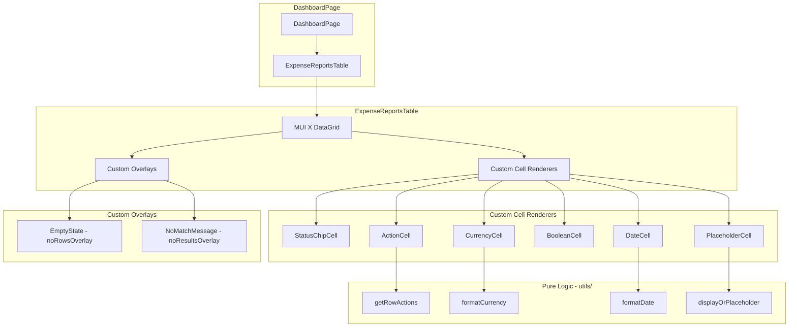

# Design Document: Expense Reports Data Table

## Overview

This feature replaces the card-based expense reports list on the Dashboard page with an MUI X DataGrid Community (`@mui/x-data-grid`) component. The DataGrid provides built-in sorting, filtering, and keyboard accessibility out of the box, significantly reducing custom code. Role-based column visibility and context-sensitive row actions are the primary custom logic. This is a frontend-only change — the existing API and hooks remain unchanged.

The design prioritizes:
- **Leveraging DataGrid built-ins**: Sorting, filtering, column menus, and accessibility come from the library — no custom sort/filter logic needed.
- **Minimal custom code**: Only cell renderers (status chip, currency, date formatting), row action logic, and column visibility are custom.
- **Existing pattern reuse**: Leverages the existing `useReports` hook, `useAuth` hook, `RejectDialog`, and `EmptyState` components without modification.

## Architecture



### Data Flow

1. `DashboardPage` fetches reports via `useReports()` and user via `useAuth()`.
2. `ExpenseReportsTable` receives `reports[]`, `user`, `isLoading`, and action handlers as props.
3. Reports are passed directly to DataGrid's `rows` prop — no pre-processing needed.
4. DataGrid handles sorting and filtering internally via its built-in model.
5. Custom `renderCell` functions handle display formatting (currency, dates, chips, placeholders).
6. The `ActionCell` component uses the pure `getRowActions()` utility to determine which buttons to render.

## Components and Interfaces

### ExpenseReportsTable (main component)

```typescript
interface ExpenseReportsTableProps {
  reports: ExpenseReportResponse[];
  isLoading: boolean;
  currentUser: UserResponse;
  onSubmit: (reportId: number) => Promise<void>;
  onAccept: (reportId: number) => Promise<void>;
  onReject: (reportId: number, adminNotes: string) => Promise<void>;
  onEdit: (reportId: number) => void;
  onDelete: (reportId: number) => Promise<void>;
  onView: (reportId: number) => void;
}
```

Responsibilities:
- Defines the `GridColDef[]` column configuration
- Conditionally includes/excludes the Owner column based on user role
- Passes `rows`, `columns`, `loading`, and slot overrides to `<DataGrid />`
- Manages RejectDialog open/close state

### DataGrid Configuration

```typescript
<DataGrid
  rows={reports}
  columns={columns}
  loading={isLoading}
  getRowId={(row) => row.id}
  disableRowSelectionOnClick
  sortingOrder={['asc', 'desc', null]}
  slots={{
    noRowsOverlay: EmptyStateOverlay,
    noResultsOverlay: NoMatchOverlay,
    loadingOverlay: LoadingOverlay,
  }}
  slotProps={{
    loadingOverlay: { 'aria-label': 'Loading expense reports' },
  }}
  initialState={{
    sorting: { sortModel: [] },
    filter: { filterModel: { items: [] } },
  }}
/>
```

### Column Definitions

```typescript
const columns: GridColDef[] = [
  {
    field: 'title',
    headerName: 'Title',
    flex: 1,
    type: 'string',
  },
  {
    field: 'total_amount',
    headerName: 'Amount',
    width: 130,
    type: 'number',
    renderCell: (params) => formatCurrency(params.value),
    valueFormatter: (value) => value, // keep raw number for sorting/filtering
  },
  {
    field: 'status',
    headerName: 'Status',
    width: 180,
    type: 'singleSelect',
    valueOptions: ['In Progress', 'Submitted', 'Scheduled for Payment', 'Rejected'],
    renderCell: (params) => <StatusChip status={params.value} />,
  },
  // Owner column — conditionally included for admins only
  {
    field: 'owner_username',
    headerName: 'Owner',
    width: 140,
    type: 'string',
  },
  {
    field: 'created_at',
    headerName: 'Created',
    width: 180,
    type: 'dateTime',
    valueGetter: (value) => new Date(value),
    renderCell: (params) => formatDate(params.value),
  },
  {
    field: 'reimbursable_from_client',
    headerName: 'Reimbursable',
    width: 130,
    type: 'singleSelect',
    valueOptions: [true, false],
    valueFormatter: (value) => value ? 'Yes' : 'No',
    renderCell: (params) => params.value ? 'Yes' : 'No',
  },
  {
    field: 'client',
    headerName: 'Client',
    width: 140,
    type: 'string',
    renderCell: (params) => displayOrPlaceholder(params.value),
  },
  {
    field: 'admin_notes',
    headerName: 'Admin Notes',
    flex: 1,
    type: 'string',
    renderCell: (params) => displayOrPlaceholder(params.value),
  },
  {
    field: 'actions',
    headerName: 'Actions',
    width: 200,
    sortable: false,
    filterable: false,
    disableColumnMenu: true,
    renderCell: (params) => <ActionCell report={params.row} currentUser={currentUser} {...actionHandlers} />,
  },
];
```

### ActionCell

```typescript
interface ActionCellProps {
  report: ExpenseReportResponse;
  currentUser: UserResponse;
  onSubmit: (reportId: number) => void;
  onAccept: (reportId: number) => void;
  onReject: (reportId: number) => void;
  onEdit: (reportId: number) => void;
  onDelete: (reportId: number) => void;
  onView: (reportId: number) => void;
}
```

Uses the pure `getRowActions()` utility to determine which buttons to render, then renders MUI IconButtons with accessible labels including the report title (e.g., `aria-label="Edit Trip to NYC"`).

### Pure Utility Functions

Located in `frontend/src/utils/tableUtils.ts`:

```typescript
// --- Row Actions ---
type ActionType = 'view' | 'edit' | 'delete' | 'submit' | 'accept' | 'reject';

function getRowActions(
  report: ExpenseReportResponse,
  currentUser: UserResponse
): ActionType[];

// --- Formatters ---
function formatCurrency(amount: number): string;
// Returns e.g. "$1,234.56" using Intl.NumberFormat

function formatDate(date: Date): string;
// Returns e.g. "Apr 23, 2026, 5:00 PM" using Intl.DateTimeFormat in user's local timezone

function displayOrPlaceholder(value: string | null | undefined): string;
// Returns "—" for null/undefined/empty/whitespace-only, otherwise the original string
```

## Data Models

### Column Visibility by Role

```typescript
function getVisibleColumns(columns: GridColDef[], isAdmin: boolean): GridColDef[] {
  if (isAdmin) return columns;
  return columns.filter(col => col.field !== 'owner_username');
}
```

### Sort Behavior

DataGrid Community provides single-column sorting with a tri-state cycle (`asc` → `desc` → `null`) out of the box via `sortingOrder={['asc', 'desc', null]}`. No custom sort logic is needed.

- Text columns: DataGrid uses locale-aware string comparison (case-insensitive)
- Numeric columns (`type: 'number'`): DataGrid uses numeric comparison
- Date columns (`type: 'dateTime'` + `valueGetter`): DataGrid uses Date comparison
- SingleSelect columns: DataGrid sorts by the display value
- Boolean/Reimbursable: Handled via `singleSelect` type with `valueFormatter`

### Filter Behavior

DataGrid Community provides single-column filtering via the column menu. Each column type gets appropriate filter operators automatically:

| Column Type | Built-in Filter Operators |
|---|---|
| `string` | contains, equals, starts with, ends with, is empty, is not empty |
| `number` | =, !=, >, >=, <, <=, is empty, is not empty |
| `dateTime` | is, is not, is after, is on or after, is before, is on or before |
| `singleSelect` | is, is not |

No custom filter logic is needed.

## Correctness Properties

### Property 1: Row actions correctness

*For any* expense report with a valid status and *for any* user (with role Admin or User, and with or without ownership of the report), `getRowActions` SHALL return exactly the set of actions specified by the requirements: Edit/Delete/Submit for owner with "In Progress" or "Rejected" status; View/Accept/Reject for admin with "Submitted" status; View only for owner (non-admin) with "Submitted" or "Scheduled for Payment" status; View only for admin with non-"Submitted" status.

**Validates: Requirements 5.2, 5.3, 5.4, 5.5**

### Property 2: Currency formatting value preservation

*For any* finite non-negative number, formatting it as US currency and then parsing the numeric value back (stripping `$` and `,`) SHALL produce a value equal to the original number rounded to two decimal places.

**Validates: Requirements 1.3**

### Property 3: Placeholder logic correctness

*For any* string value that is null, undefined, or composed entirely of whitespace, `displayOrPlaceholder` SHALL return "—". *For any* string containing at least one non-whitespace character, `displayOrPlaceholder` SHALL return the original string.

**Validates: Requirements 1.6**

### Property 4: Column visibility correctness

*For any* user with the Admin role, `getVisibleColumns` SHALL include the `owner_username` column. *For any* user with the User role, `getVisibleColumns` SHALL exclude the `owner_username` column. In both cases, all other columns SHALL be present and in the same order.

**Validates: Requirements 4.3, 4.4, 4.5**

## Error Handling

### Network Errors
- The existing `useReports` hook handles fetch failures by setting an `error` state string.
- The `ErrorAlert` component renders the error message above the table.
- No additional error handling is needed for the DataGrid itself.

### Action Failures
- Action handlers (`onSubmit`, `onAccept`, `onReject`, `onDelete`) are async and may throw.
- Errors from these handlers bubble up to `DashboardPage` which already displays them via `ErrorAlert`.
- The table does not need its own error state for actions.

### Edge Cases
- Reports with missing/unexpected status values: The `getRowActions` function defaults to showing only "View" for unrecognized statuses. The StatusChip renders with `default` color.
- Reports with extremely long text: DataGrid handles text overflow with ellipsis by default.
- Null values in sortable columns: DataGrid handles null/undefined values in sorting natively.

## Testing Strategy

### Property-Based Tests (fast-check + Vitest)

The following pure utility functions are tested with property-based tests using `fast-check`:

| Function | Properties Tested | Min Iterations |
|---|---|---|
| `getRowActions` | Property 1 (action correctness) | 100 |
| `formatCurrency` | Property 2 (value preservation) | 100 |
| `displayOrPlaceholder` | Property 3 (placeholder logic) | 100 |
| `getVisibleColumns` | Property 4 (column visibility) | 100 |

Each property test is tagged with a comment:
```typescript
// Feature: expense-reports-data-table, Property N: [description]
```

**PBT Library**: `fast-check` (already installed in devDependencies)

**Configuration**: Each test runs a minimum of 100 iterations via `fc.assert(fc.property(...), { numRuns: 100 })`.

### Unit Tests (Vitest + React Testing Library)

Example-based tests for:
- Component rendering (column order, status chip colors, currency/date formatting)
- DataGrid loading state (loading overlay displayed)
- Empty state overlay (EmptyState component rendered)
- No-results overlay (message displayed when filter matches nothing)
- Role-based column visibility (Owner column shown/hidden)
- Action button rendering per status/role combination
- Action button click handlers invoked correctly
- Accessible labels on action buttons include report title
- RejectDialog opens on Reject button click

### Test File Organization

```
frontend/src/utils/__tests__/
  tableUtils.test.ts          # Property-based tests for getRowActions, formatCurrency, displayOrPlaceholder, getVisibleColumns

frontend/src/components/__tests__/
  ExpenseReportsTable.test.tsx # Component rendering, overlays, column visibility
  ActionCell.test.tsx          # Action button rendering and click handler tests
```

## Dependencies

### New Package

```
@mui/x-data-grid  (MIT license, Community edition)
```

Install via: `npm install @mui/x-data-grid`

This package is part of the MUI X ecosystem and integrates seamlessly with the existing `@mui/material` theme and components.
