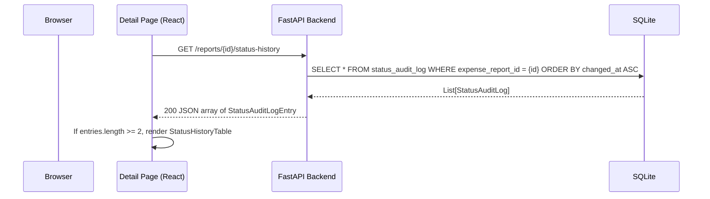
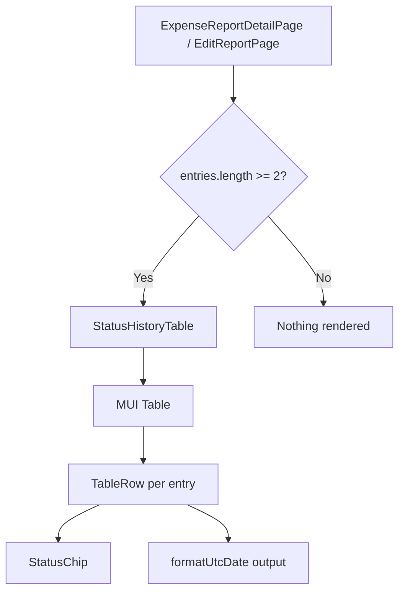

# Design Document: Status History Table

## Overview

This feature adds a read-only status history table to expense report detail pages (both view and edit). The table displays a chronological list of status changes from the existing `Status_Audit_Log` backend model, showing each status as a color-coded pill alongside a human-readable local datetime.

The implementation spans three layers:
1. **Backend**: A new REST endpoint to retrieve audit log entries for a specific report
2. **Frontend API client**: A typed fetch function to call the new endpoint
3. **Frontend component**: A `StatusHistoryTable` React component rendered conditionally at the bottom of both detail pages

### Key Design Decisions

- **Dedicated endpoint over embedding in report response**: The status history is fetched via a separate sub-resource endpoint (`GET /reports/{id}/status-history`) rather than embedding it in the existing `ExpenseReportResponse`. This keeps the existing report payload lean and avoids breaking changes to consumers that don't need history data.
- **Reuse existing `StatusChip` component**: The frontend already has a `StatusChip` component with color-coding logic. The history table reuses it directly.
- **Reuse existing `formatUtcDate` utility**: The `formatDate.ts` utility already implements the exact Intl formatting spec required (month short, day numeric, year numeric, hour numeric, minute 2-digit) with null/undefined fallback to "—".
- **Conditional rendering via entry count**: The frontend hides the table when the API returns fewer than 2 entries, keeping the page clean for reports that haven't transitioned yet.

---

## Architecture



### Component Hierarchy



---

## Components and Interfaces

### Backend

#### New Endpoint: `GET /reports/{report_id}/status-history`

Added to the existing `reports` router (`backend/app/routers/reports.py`).

```python
@router.get("/{report_id}/status-history", response_model=List[StatusAuditLogEntry])
def get_status_history(
    report_id: int,
    current_user: User = Depends(get_current_user),
    db: Session = Depends(get_db),
) -> List[StatusAuditLogEntry]:
    ...
```

**Authorization logic**:
- Authenticated user must be the report owner OR have the Admin role
- Returns 401 if unauthenticated, 404 if report doesn't exist, 403 if unauthorized

**Query**: Fetches all `StatusAuditLog` rows for the given `expense_report_id`, ordered by `changed_at ASC`.

#### Existing Schema (already defined)

The `StatusAuditLogEntry` Pydantic schema already exists in `backend/app/schemas/expense_report.py`:

```python
class StatusAuditLogEntry(BaseModel):
    id: int
    expense_report_id: int
    status: str
    changed_at: datetime

    model_config = ConfigDict(from_attributes=True)
```

No new schema is needed.

### Frontend

#### API Client Function: `getStatusHistory`

New function in `frontend/src/api/reports.ts`:

```typescript
export async function getStatusHistory(reportId: number): Promise<StatusAuditLogEntry[]> {
  return apiFetch<StatusAuditLogEntry[]>(`/reports/${reportId}/status-history`);
}
```

The `StatusAuditLogEntry` TypeScript interface already exists in `frontend/src/types/expenseReport.ts`.

#### Component: `StatusHistoryTable`

New file: `frontend/src/components/StatusHistoryTable.tsx`

```typescript
interface StatusHistoryTableProps {
  entries: StatusAuditLogEntry[];
}

export function StatusHistoryTable({ entries }: StatusHistoryTableProps) { ... }
```

**Behavior**:
- Receives pre-fetched entries as a prop (parent handles fetch and conditional rendering)
- Renders an MUI `Table` with two columns: "Status" and "Date"
- Each row renders a `StatusChip` and the output of `formatUtcDate(entry.changed_at)`
- Rows are ordered earliest-to-latest (API guarantees this order)
- No sorting, filtering, pagination, or interactive controls
- Renders all rows inline (no internal scroll container)

#### Integration into Detail Pages

Both `ExpenseReportDetailPage` and `EditReportPage`:
1. Call `getStatusHistory(reportId)` on mount (alongside existing data fetches)
2. Store the result in local state
3. Conditionally render `<StatusHistoryTable entries={entries} />` at the bottom of the page when `entries.length >= 2`
4. On the Edit page, the table is rendered **outside** the `<form>` element
5. A `<Typography variant="h6">` heading "Status History" is rendered above the table

After a status transition action (submit/accept/reject) on the same page, the status history is re-fetched to reflect the new entry.

---

## Data Models

### Existing: `StatusAuditLog` (SQLAlchemy)

| Column | Type | Constraints |
|--------|------|-------------|
| `id` | Integer | PK, autoincrement |
| `expense_report_id` | Integer | FK → `expense_reports.id`, indexed, NOT NULL |
| `status` | String(50) | NOT NULL |
| `changed_at` | DateTime | NOT NULL (UTC) |

No schema changes are required. The model and its relationship to `ExpenseReport` already exist.

### API Response Shape

```json
[
  {
    "id": 1,
    "expense_report_id": 42,
    "status": "In Progress",
    "changed_at": "2026-04-20T10:00:00Z"
  },
  {
    "id": 2,
    "expense_report_id": 42,
    "status": "Submitted",
    "changed_at": "2026-04-23T17:00:00Z"
  }
]
```

### TypeScript Interface (existing)

```typescript
interface StatusAuditLogEntry {
  id: number;
  expense_report_id: number;
  status: string;
  changed_at: string; // ISO 8601 UTC
}
```

---


## Correctness Properties

*A property is a characteristic or behavior that should hold true across all valid executions of a system — essentially, a formal statement about what the system should do. Properties serve as the bridge between human-readable specifications and machine-verifiable correctness guarantees.*

### Property 1: Audit entry serialization round-trip

*For any* valid `StatusAuditLog` ORM instance with an arbitrary status string and UTC datetime, serializing it through the `StatusAuditLogEntry` Pydantic schema and then parsing the JSON output SHALL produce a dictionary containing the same `status` string and a `changed_at` value that is a valid ISO 8601 datetime string representing the same point in time.

**Validates: Requirements 1.2**

### Property 2: Status history ordering invariant

*For any* set of `StatusAuditLog` entries associated with an expense report, the endpoint SHALL return them in non-decreasing order of `changed_at` — that is, for every consecutive pair of entries in the response, the first entry's `changed_at` is less than or equal to the second entry's `changed_at`.

**Validates: Requirements 1.3**

### Property 3: Authorized access returns complete history

*For any* expense report with N audit log entries, when an authenticated user who is either the report owner or has the Admin role requests the status history, the response SHALL contain exactly N entries, and the set of entry IDs in the response SHALL equal the set of entry IDs in the database for that report.

**Validates: Requirements 1.4**

### Property 4: Conditional display threshold

*For any* array of `StatusAuditLogEntry` objects, the `StatusHistoryTable` component SHALL be rendered in the DOM if and only if the array length is greater than or equal to 2. When the array length is 0 or 1, no table element SHALL be present in the rendered output.

**Validates: Requirements 2.1, 2.2**

### Property 5: Row content completeness

*For any* non-empty array of `StatusAuditLogEntry` objects passed to the `StatusHistoryTable` component, the rendered output SHALL contain exactly one row per entry, and each row SHALL contain the entry's status value (rendered as a StatusChip) and the output of `formatUtcDate(entry.changed_at)`.

**Validates: Requirements 3.2, 5.2**

### Property 6: Date formatting produces human-readable non-ISO output

*For any* valid UTC ISO 8601 datetime string, `formatUtcDate` SHALL return a string that does NOT match the ISO 8601 pattern (`/\d{4}-\d{2}-\d{2}T/`) and that contains recognizable date components (a month abbreviation, a numeric day, a numeric year, and a time component).

**Validates: Requirements 3.4, 3.5, 3.6**

---

## Error Handling

### Backend

| Scenario | HTTP Status | Response Body |
|----------|-------------|---------------|
| No session cookie / invalid session | 401 | `{"detail": "Not authenticated"}` |
| Report ID does not exist | 404 | `{"detail": "Report not found"}` |
| User is not owner and not Admin | 403 | `{"detail": "Not authorized"}` |
| Invalid report_id path param (non-integer) | 422 | FastAPI validation error |

The endpoint reuses the existing `get_current_user` dependency for 401 handling. Authorization and existence checks follow the same pattern used by other report sub-resource endpoints.

### Frontend

| Scenario | Handling |
|----------|----------|
| API returns 401 | Redirect to login (handled by global auth interceptor) |
| API returns 403 or 404 | Do not render the status history table; optionally log to console |
| API returns 5xx or network error | Do not render the table; fail silently (table is supplementary info) |
| API returns empty array or single entry | Do not render the table (conditional display logic) |
| Entry has null `changed_at` | `formatUtcDate` returns "—" placeholder |

The status history table is non-critical supplementary information. Fetch failures should not block the rest of the detail page from rendering. The fetch is performed independently of the main report data fetch.

---

## Testing Strategy

### Backend (pytest)

**Unit Tests:**
- `StatusAuditLogEntry` Pydantic schema serialization with various status/datetime values
- Authorization logic: owner access, admin access, unauthorized user, unauthenticated user
- Ordering logic: entries returned in chronological order regardless of insertion order
- Edge cases: report with 0 entries, report with 1 entry, report with many entries

**Integration Tests:**
- `GET /reports/{id}/status-history` returns 200 with correct shape for owner
- `GET /reports/{id}/status-history` returns 200 for admin (non-owner)
- `GET /reports/{id}/status-history` returns 401 without auth
- `GET /reports/{id}/status-history` returns 403 for non-owner non-admin
- `GET /reports/{id}/status-history` returns 404 for non-existent report

**Property-Based Tests (Hypothesis):**
- Property 1: Serialization round-trip for `StatusAuditLogEntry`
- Property 2: Ordering invariant on generated audit entry lists
- Property 3: Authorized access completeness

Configuration: minimum 100 iterations per property test. Each test tagged with:
```python
# Feature: status-history-table, Property {N}: {property_text}
```

### Frontend (Vitest)

**Unit Tests:**
- `StatusHistoryTable` renders correct number of rows
- `StatusHistoryTable` renders StatusChip with correct status for each row
- `StatusHistoryTable` renders formatted dates (not raw ISO strings)
- `StatusHistoryTable` renders "—" for null `changed_at`
- `StatusHistoryTable` has "Status" and "Date" column headers
- `StatusHistoryTable` contains no interactive elements (buttons, inputs)
- Conditional rendering: table shown when entries >= 2, hidden when < 2
- `getStatusHistory` API function calls correct endpoint

**Property-Based Tests (fast-check):**
- Property 4: Conditional display threshold
- Property 5: Row content completeness
- Property 6: Date formatting non-ISO output

Configuration: minimum 100 iterations per property test. Each test tagged with:
```typescript
// Feature: status-history-table, Property {N}: {property_text}
```

### Test Libraries

- **Backend PBT**: Hypothesis (already in use in the project — `.hypothesis/` directory exists)
- **Frontend PBT**: fast-check (standard PBT library for TypeScript/Vitest)
